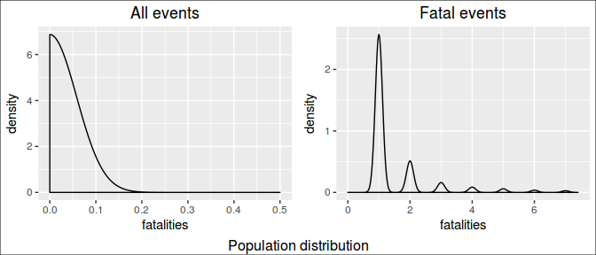
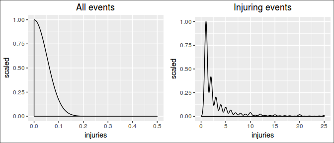
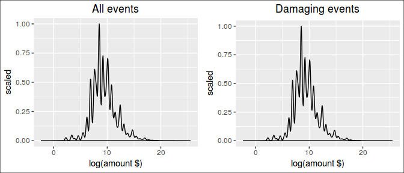
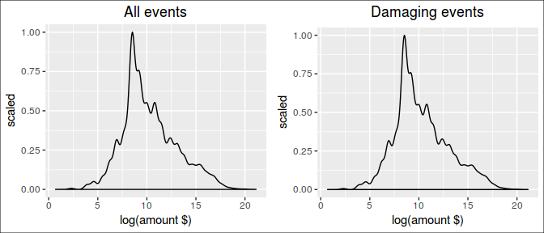
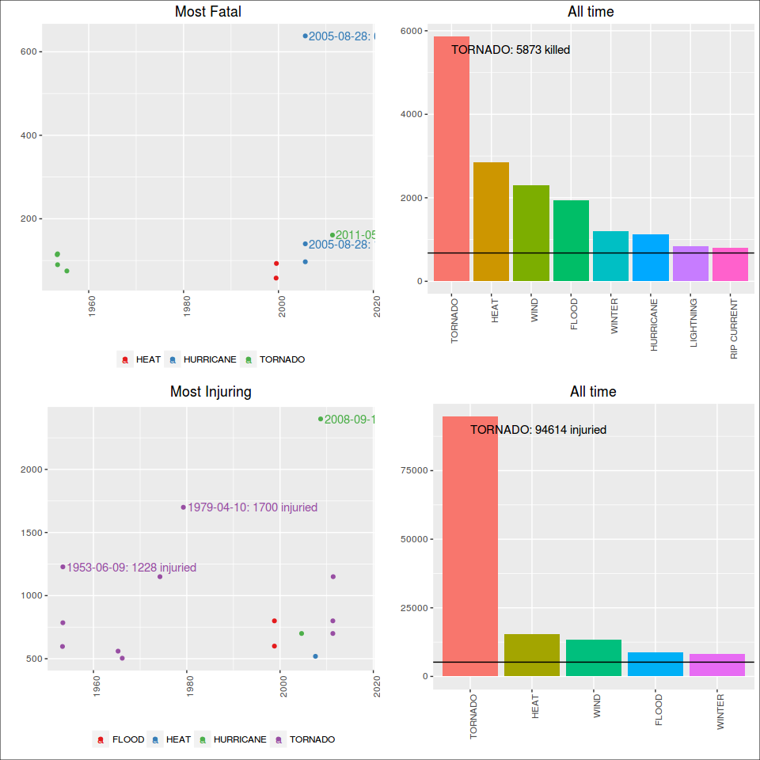
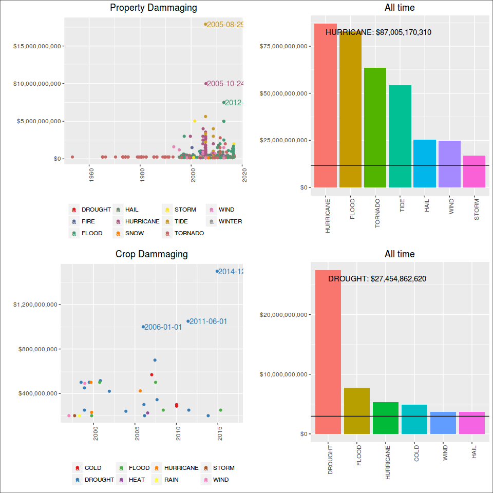
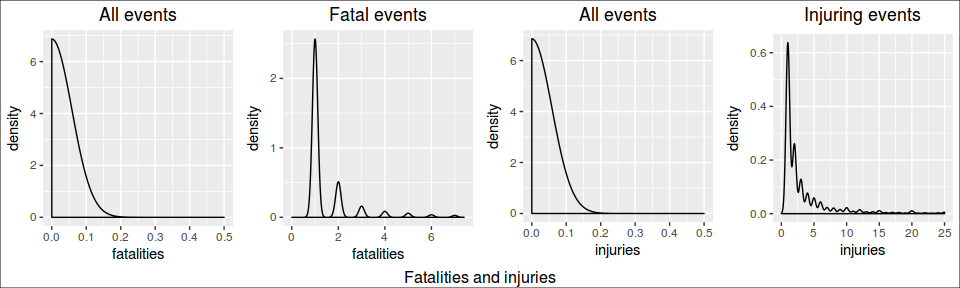
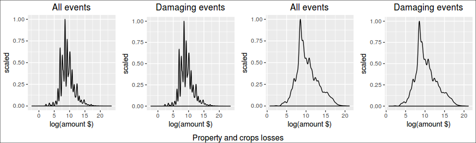

NOAA Storm Database: the worst events
=====================================

NOAA Storm Database Study: the worst events

In this study we have analysed the NOAA Storm Database in order to
determine what are the worst natural catastrophic events, both in terms
of public health and in economic impact.

The U.S. National Oceanic and Atmospheric Administration's (NOAA) storm
database tracks characteristics of major storms and weather events in
the United States, including when and where they occur, as well as
estimates of any fatalities, injuries, and property damage.

The database currently contains data from January 1950 to January 2017,
as entered by NOAA's National Weather Service (NWS).

The database can be found on:

<https://www.ncdc.noaa.gov/stormevents/ftp.jsp>

RPubs version, with fewer plots, for Coursera:
<http://rpubs.com/erickfis/noaa>

Objective
---------

The goal of this study is to answer the questions:

1.  Across the United States, which types of events were the most
    harmful with respect to population health ever recorded in a single
    occurrence?

2.  Which types of events caused most harm to population health along
    all those years?

3.  Which types of events had the greatest economic consequences in a
    single occurrence?

4.  Which types of events had the greatest economic consequences along
    all those years?

5.  Which were the places that were subject to the greatest losses, both
    in terms of human health and economic losses.

Data Processing
---------------

Data Processing

This code loads the original data and them choose which variables are
useful to answer our questions:

    library(scales)
    library(stringr)
    library(data.table)
    library(chron)
    library(dplyr)
    library(lubridate)
    library(ggplot2)
    library(rmarkdown)
    library(RColorBrewer)
    library(gridExtra)
    library(grid)

Reading original database:

    #fileUrl <- "https://d396qusza40orc.cloudfront.net/repdata%2Fdata%2FStormData.csv.bz2"

    #download.file(fileUrl, "StormData.bz2", method = "curl")

    #Full data
    dados <- fread(sprintf("bzcat %s | tr -d '\\000'", "StormData.bz2"), na.strings = "")

    ## 
    Read 22.7% of 967216 rows
    Read 47.6% of 967216 rows
    Read 62.0% of 967216 rows
    Read 79.6% of 967216 rows
    Read 902297 rows and 37 (of 37) columns from 0.523 GB file in 00:00:07

    dados <-tbl_df(dados)

    # this do a sample data base, with 50000 obs, used for speeding up initial works:
    # linhas <- nrow(dados)
    # linhas <- sample(linhas,50000)
    # dataS <- dados[linhas,]
    # write.csv(dataS, "StormData")

    # dados <- fread(sprintf("bzcat %s | tr -d '\\000'", "StormData.bz2"))
    # dados <-tbl_df(dados)
    # dados <- select(dados, -1)

    # treating var names
    names(dados) <- gsub("_", ".", tolower(names(dados)))
    names(dados)   

    ##  [1] "state.."    "bgn.date"   "bgn.time"   "time.zone"  "county"    
    ##  [6] "countyname" "state"      "evtype"     "bgn.range"  "bgn.azi"   
    ## [11] "bgn.locati" "end.date"   "end.time"   "county.end" "countyendn"
    ## [16] "end.range"  "end.azi"    "end.locati" "length"     "width"     
    ## [21] "f"          "mag"        "fatalities" "injuries"   "propdmg"   
    ## [26] "propdmgexp" "cropdmg"    "cropdmgexp" "wfo"        "stateoffic"
    ## [31] "zonenames"  "latitude"   "longitude"  "latitude.e" "longitude."
    ## [36] "remarks"    "refnum"

This database has 902297 observations. Each observation corresponds to
an event occurrence.

To determine the most harmful events to human health, we will check the
variables related to human health, which are "fatalities" and
"injuries".

To determine the most harmful events to economy, we will check the
variables related to economic measures, from "propdmg" through
"cropdmgexp".

Also, in order to analyse various occurrences of the same event, we will
measure the duration of the event, its magnitude and where the event
occurred (state and county name).

    # select desired vars
    harm.df <- dados %>% select(evtype, mag, state, countyname, bgn.date, end.date, 23:28)

    # treat vars
    harm.df <- harm.df %>% 
            mutate(bgn.date = mdy_hms(bgn.date), end.date = mdy_hms(end.date),  
                   day = as.Date(bgn.date, "%m/%d/%Y"), 
                   duration = -as.period(interval(end.date, bgn.date)),
                   event = tolower(as.character(evtype)),
                   countyname =strtrim(countyname,9)) %>%
            select(event, 2, day, duration, 3:4, 7:12)

    # fixing exp for economic data
    harm.df$propdmgexp[which(harm.df$propdmgexp=="K")] <- as.character(3)
    harm.df$propdmgexp[which(harm.df$propdmgexp=="m")] <- as.character(6)
    harm.df$propdmgexp[which(harm.df$propdmgexp=="M")] <- as.character(6)
    harm.df$propdmgexp[which(harm.df$propdmgexp=="B")] <- as.character(9)
    harm.df$propdmgexp <- as.numeric(harm.df$propdmgexp)

    harm.df$cropdmgexp[which(harm.df$cropdmgexp=="K")] <- as.character(3)
    harm.df$cropdmgexp[which(harm.df$cropdmgexp=="m")] <- as.character(6)
    harm.df$cropdmgexp[which(harm.df$cropdmgexp=="M")] <- as.character(6)
    harm.df$cropdmgexp[which(harm.df$cropdmgexp=="B")] <- as.character(9)
    harm.df$cropdmgexp <- as.numeric(harm.df$cropdmgexp)

    harm.df <- mutate(harm.df, prop.ev = propdmg*10^propdmgexp,
                    crop.ev = cropdmg*10^cropdmgexp)

This is a really big database which data has been being registered by a
lot of different people since 1950. Thus, as expected, there are
variations on how people registered events.

For exemple, the string "snow" was used to register a lot of events.
They are the same type of event, but count as different:

    eventos <- grep("snow", harm.df$event, value = TRUE)
    eventos <- sort(unique(eventos))
    length(eventos)

    ## [1] 118

    eventos[1:10]

    ##  [1] "accumulated snowfall"           "blizzard and heavy snow"       
    ##  [3] "blizzard/heavy snow"            "blowing snow"                  
    ##  [5] "blowing snow & extreme wind ch" "blowing snow- extreme wind chi"
    ##  [7] "blowing snow/extreme wind chil" "cold and snow"                 
    ##  [9] "drifting snow"                  "early snow"

This is why we decided to filter those events: we grouped them by its
commom strings.

    # treating event types

    eventos <- harm.df$event
    # first, need to see what are the event types
    contagem <- sort(table(eventos))

    # them we create this list of terms
     
    lista.search <- c(
    "dry",        
    "fog",        
    "wind",
    "winter",
    "slide",
    "snow",
    "flood",
    "fld",
    "cold|freez",
    "hurricane",
    "tornado",
    "rain|precip",
    "hail",
    "heat|warm",
    "tide",
    "storm",
    "record",
    "blizzard",
    "fire",
    "funnel",
    "surf")

    lista.replace <- c(
    "drought",
    "fog",        
    "wind",
    "winter",
    "slide",
    "snow",
    "flood",
    "flood",
    "cold",
    "hurricane",
    "tornado",
    "rain",
    "hail",
    "heat",
    "tide",
    "storm",
    "record temperature",
    "blizzard",
    "fire",
    "funnel",
    "surf")

    for (i in 1:length(lista.search)) {
            eventos[grepl(lista.search[i], eventos)] <- lista.replace[i]
            
    }

    # lets group the events whose count is < 5 and call it "other"
    contagem <- sort(table(eventos))
    outros <- names(contagem[contagem<5])
    eventos[eventos %in% outros] <- "other"
    # sort(table(eventos))

    # returning treated events
    harm.df$event <- toupper(eventos)

    # Treating County Names
    cidades <- toupper(harm.df$countyname)
    cidades <- str_trim(cidades)

    cidades <- gsub("_| |-", ".", cidades)

    cidades[grep("\\.\\.$", cidades)] <- gsub("\\.\\.", "",
                                    cidades[grep("\\.\\.$", cidades)]
                                            )

    cidades <- sapply(strsplit(cidades, split=">", fixed=TRUE), function(x) (x[1]))
    cidades <- sapply(strsplit(cidades, split="(", fixed=TRUE), function(x) (x[1]))
    cidades <- sapply(strsplit(cidades, split=",", fixed=TRUE), function(x) (x[1]))

    harm.df$countyname <- cidades

    rm(dados) # house cleanning

Human health: the most harmfull events
--------------------------------------

We have determined what events did more harm to human health.

There were occurrences that caused zero fatalities but a lot of
injuries. The inverse is also true, so we did a separate analysis to
fatal and non-fatal events.

### Fatal Occurrences

### Most fatal in a single occurrence

Most fatal in a single occurrence

In order to determine what were the most fatal events in a single
occurrence, we need to see how fatalities are distributed along the
occurrences.

    # subset original data
    fatal.df <- harm.df %>% 
                    filter(!is.na(fatalities)) %>%
                    select(1:7)

      
    # quantiles
    qt <- quantile(fatal.df$fatalities, probs=seq(.9,1,0.001))

    # distribution plot

    plt.distr.fatal0 <- ggplot(fatal.df, aes(fatalities))

    plt.distr.fatal0 <- plt.distr.fatal0 + geom_density(aes(y=..density..)) + xlim(0,.5) + 
            labs(title="All events") +
            theme(plot.title = element_text(hjust = 0.5))

    # display only the qts next to fatal events
    qt[(length(qt)-(length(qt[qt>=1])+1)): length(qt)]

    ##  99.1%  99.2%  99.3%  99.4%  99.5%  99.6%  99.7%  99.8%  99.9% 100.0% 
    ##      0      0      1      1      1      1      1      2      3    583

Looking at this distribution, we can infer that the vast majority of
those occurrences were not fatal at all: **99.2% occurrences didn't
caused any fatalities.**

On the other hand, fatal occurrences had to have at least 1 fatality.

Now, among the fatal occurrences, we are interested in the ones whose
fatalities are beyond the confidence interval, ie. above 99% of the most
common values.

    # subset for fatal events
    fatal.df <- filter(fatal.df, fatalities > 0) %>%
                    arrange(desc(fatalities)) %>%
                    mutate(mean = mean(fatalities), 
                    median = median(fatalities),
                    rank = seq_len(length(event)))

    # quantiles, same as 
    # poisson.test(mean, conf.level = 0.95)

    qt <- quantile(fatal.df$fatalities, probs=seq(.999,1,0.005))
    qt

    ##  99.9% 
    ## 74.027

Looking at this distribution, we can infer that **99.8% of the fatal
occurrences caused up to 74.027 fattalities**.

Distribution plots

    # distribution plot
     
    plt.distr.fatal1 <- ggplot(fatal.df, aes(fatalities))

    plt.distr.fatal1 <- plt.distr.fatal1 + geom_density(aes(y=..density..)) + 
            xlim(0,(qt[1]/10)) + 
            labs(title="Fatal events") +
            theme(plot.title = element_text(hjust = 0.5))

    grid.arrange(plt.distr.fatal0, plt.distr.fatal1, nrow=1, ncol=2, 
                 bottom="Population distribution")
    grid.rect(gp=gpar(fill=NA))

In this study, we looked on the 1% deadliest occurrences.

    # subset for 99% CI
    fatal95.df <- fatal.df %>% filter(fatalities>qt[1])
                    
    # create color pallete for all events
    colourCount.fatal.single = length(unique(fatal95.df$event))
    getPalette = colorRampPalette(brewer.pal(colourCount.fatal.single, "Set1"))

    # print a table
    kable(fatal95.df[, c(10,1:9)])

<table>
<thead>
<tr class="header">
<th align="right">rank</th>
<th align="left">event</th>
<th align="right">mag</th>
<th align="left">day</th>
<th align="right">duration</th>
<th align="left">state</th>
<th align="left">countyname</th>
<th align="right">fatalities</th>
<th align="right">mean</th>
<th align="right">median</th>
</tr>
</thead>
<tbody>
<tr class="odd">
<td align="right">1</td>
<td align="left">HEAT</td>
<td align="right">0</td>
<td align="left">1995-07-12</td>
<td align="right">0S</td>
<td align="left">IL</td>
<td align="left">ILZ003</td>
<td align="right">583</td>
<td align="right">2.171638</td>
<td align="right">1</td>
</tr>
<tr class="even">
<td align="right">2</td>
<td align="left">TORNADO</td>
<td align="right">0</td>
<td align="left">2011-05-22</td>
<td align="right">0S</td>
<td align="left">MO</td>
<td align="left">JASPER</td>
<td align="right">158</td>
<td align="right">2.171638</td>
<td align="right">1</td>
</tr>
<tr class="odd">
<td align="right">3</td>
<td align="left">TORNADO</td>
<td align="right">0</td>
<td align="left">1953-06-08</td>
<td align="right">NA</td>
<td align="left">MI</td>
<td align="left">GENESEE</td>
<td align="right">116</td>
<td align="right">2.171638</td>
<td align="right">1</td>
</tr>
<tr class="even">
<td align="right">4</td>
<td align="left">TORNADO</td>
<td align="right">0</td>
<td align="left">1953-05-11</td>
<td align="right">NA</td>
<td align="left">TX</td>
<td align="left">MCLENNAN</td>
<td align="right">114</td>
<td align="right">2.171638</td>
<td align="right">1</td>
</tr>
<tr class="odd">
<td align="right">5</td>
<td align="left">HEAT</td>
<td align="right">0</td>
<td align="left">1999-07-28</td>
<td align="right">0S</td>
<td align="left">IL</td>
<td align="left">ILZ005</td>
<td align="right">99</td>
<td align="right">2.171638</td>
<td align="right">1</td>
</tr>
<tr class="even">
<td align="right">6</td>
<td align="left">TORNADO</td>
<td align="right">0</td>
<td align="left">1953-06-09</td>
<td align="right">NA</td>
<td align="left">MA</td>
<td align="left">WORCESTER</td>
<td align="right">90</td>
<td align="right">2.171638</td>
<td align="right">1</td>
</tr>
<tr class="odd">
<td align="right">7</td>
<td align="left">TORNADO</td>
<td align="right">0</td>
<td align="left">1955-05-25</td>
<td align="right">NA</td>
<td align="left">KS</td>
<td align="left">COWLEY</td>
<td align="right">75</td>
<td align="right">2.171638</td>
<td align="right">1</td>
</tr>
</tbody>
</table>

    # prepare text for inline R
    worst.fatal.single.ev <- fatal95.df$event[1]
    worst.fatal.single.st <- fatal95.df$state[1]
    worst.fatal.single.ct <- fatal95.df$countyname[1]
    worst.fatal.single.dt <- fatal95.df$day[1]
    worst.fatal.single.kill <- fatal95.df$fatalities[1]

    # the plot
    plt.fatal.single <- ggplot(fatal95.df, aes(day, fatalities, colour=event))

    plt.fatal.single <- plt.fatal.single + geom_point() +
            geom_text(aes(label=ifelse(rank <= 3,
                     paste0(as.character(day), ": ", fatalities, " killed") ,""),
                    hjust=-.03,vjust=0.5)) +

            # geom_hline(aes(yintercept = mean), linetype=2) +
            # geom_hline(aes(yintercept = median), linetype=3) +
            labs(title="Most Fatal",
                        y="", x="") +
        
            expand_limits(x=as.Date('2017-01-01'))+ #ok
            scale_colour_manual(values = getPalette(colourCount.fatal.single))+                
            theme(legend.title=element_blank()) +
            theme(legend.position="bottom") +
            guides(fill=guide_legend(nrow=5, byrow=TRUE)) +
            theme(axis.text.x = element_text(angle = 90, hjust = 1)) + 
            theme(plot.title = element_text(hjust = 0.5))                 

    plt.fatal.single + labs(title="Most fatal Occurrence",
                        y="Fatalities", x="")

The single most fatal event was a **HEAT, that occurred in IL, ILZ003,
on 1995-07-12, killing 583 people.**

However, if we compare this single awful event to the mean of fatalities
caused, we see that this is very unlikely to happen.

### Most fatal in all time

Most fatal in all time

Notice that are several occurrences of the same type of event along the
time.

Therefore, in order to know which is the worst type of event along all
the years, we summed up the fatalities caused by each one of occurrences
of this events.

Notice that we are interested only in the worst of them, ie, the ones
which are above the mean.

    # totals per event
    fatal.all.df <- fatal.df %>% group_by(event) %>%
            summarise(total = sum(fatalities)) %>% arrange(desc(total)) %>% 
            mutate(mean = mean(total), median = median(total),
                   rank = seq_len(length(event))) %>%
            filter(total > mean(total))

    # create color pallete for all events
    colourCount.fatal.all = length(unique(fatal.all.df$event))
    getPalette = colorRampPalette(brewer.pal(colourCount.fatal.all, "Set1"))

    # prepare text for inline R
    worst.fatal.all.ev <- fatal.all.df$event[1]
    worst.fatal.all.kill <- fatal.all.df$total[1]

    # a table
    kable(fatal.all.df[,c(5,1:4)])

<table>
<thead>
<tr class="header">
<th align="right">rank</th>
<th align="left">event</th>
<th align="right">total</th>
<th align="right">mean</th>
<th align="right">median</th>
</tr>
</thead>
<tbody>
<tr class="odd">
<td align="right">1</td>
<td align="left">TORNADO</td>
<td align="right">5636</td>
<td align="right">398.5526</td>
<td align="right">38.5</td>
</tr>
<tr class="even">
<td align="right">2</td>
<td align="left">HEAT</td>
<td align="right">3149</td>
<td align="right">398.5526</td>
<td align="right">38.5</td>
</tr>
<tr class="odd">
<td align="right">3</td>
<td align="left">FLOOD</td>
<td align="right">1553</td>
<td align="right">398.5526</td>
<td align="right">38.5</td>
</tr>
<tr class="even">
<td align="right">4</td>
<td align="left">WIND</td>
<td align="right">1451</td>
<td align="right">398.5526</td>
<td align="right">38.5</td>
</tr>
<tr class="odd">
<td align="right">5</td>
<td align="left">LIGHTNING</td>
<td align="right">816</td>
<td align="right">398.5526</td>
<td align="right">38.5</td>
</tr>
</tbody>
</table>

    # the plot
    plt.fatal.all <- ggplot(data=fatal.all.df, aes(event, total, fill=event))

    plt.fatal.all <- plt.fatal.all + geom_bar(stat="identity") +
            geom_text(aes(label=ifelse(total==max(total),
                    paste0(event, ": ", max(total), " killed"),'')),
                    hjust=0,vjust=2) +
            geom_hline(aes(yintercept = mean), linetype=1) +
            # geom_hline(aes(yintercept = median), linetype=2) +
            labs(title="All time", y="",
                 x="") + 
                    
            theme(legend.position="none") +        
            scale_colour_manual(values = getPalette(colourCount.fatal.all))+                
            theme(legend.title=element_blank()) +
            theme(axis.text.x = element_text(angle = 90, hjust = 1)) + 
            theme(plot.title = element_text(hjust = 0.5))                 

    plt.fatal.all + labs(title="Most fatal type of event - all time",
                        y="Fatalities", x="")                

The most fatal event along the time is the **TORNADO. It has killed 5636
people until now.**

Just for curiosity, these are the less fatal among the fatal events:

    # sort for less dangerous, had to subset again due to previous filtering
    fatal.all.df <- fatal.df %>% group_by(event) %>%
            summarise(total = sum(fatalities)) %>% arrange(total) %>% 
            mutate(mean = mean(total), median = median(total),
                   rank = seq(length(event),1, by=-1))

    # a table
    kable(fatal.all.df[1:10,c(5,1:2)])

<table>
<thead>
<tr class="header">
<th align="right">rank</th>
<th align="left">event</th>
<th align="right">total</th>
</tr>
</thead>
<tbody>
<tr class="odd">
<td align="right">38</td>
<td align="left">BLACK ICE</td>
<td align="right">1</td>
</tr>
<tr class="even">
<td align="right">37</td>
<td align="left">FROST</td>
<td align="right">1</td>
</tr>
<tr class="odd">
<td align="right">36</td>
<td align="left">HIGH SWELLS</td>
<td align="right">1</td>
</tr>
<tr class="even">
<td align="right">35</td>
<td align="left">WINTRY MIX</td>
<td align="right">1</td>
</tr>
<tr class="odd">
<td align="right">34</td>
<td align="left">DUST DEVIL</td>
<td align="right">2</td>
</tr>
<tr class="even">
<td align="right">33</td>
<td align="left">SLEET</td>
<td align="right">2</td>
</tr>
<tr class="odd">
<td align="right">32</td>
<td align="left">HIGH WATER</td>
<td align="right">3</td>
</tr>
<tr class="even">
<td align="right">31</td>
<td align="left">WATERSPOUT</td>
<td align="right">3</td>
</tr>
<tr class="odd">
<td align="right">30</td>
<td align="left">HIGH SEAS</td>
<td align="right">5</td>
</tr>
<tr class="even">
<td align="right">29</td>
<td align="left">ICY ROADS</td>
<td align="right">5</td>
</tr>
</tbody>
</table>

### Injuring Occurrences

### Most injuring in a single occurrence

Most injuring in a single occurrence

In order to determine what were the most injuring events in a single
occurrence, we need to see how injuries are distributed along the
occurrences.

    rm(fatal.df,fatal.all.df, fatal95.df, qt) # cleannig house

    injuring.df <- harm.df %>% filter(!is.na(injuries)) %>%
                    select(1:6,8)

    # quantiles
    qt <- quantile(injuring.df$injuries, probs=seq(.975,1,0.002))

    # distribution plot
    plt.distr.inj0 <- ggplot(injuring.df, aes(injuries))

    plt.distr.inj0 <- plt.distr.inj0 + geom_density(aes(y=..density..)) + xlim(0,0.5) + 
            labs(title="All events") +
            theme(plot.title = element_text(hjust = 0.5))

    # display only the qts next to injuring events
    qt[(length(qt)-(length(qt[qt>=1])+1)): length(qt)]

    ## 97.7% 97.9% 98.1% 98.3% 98.5% 98.7% 98.9% 99.1% 99.3% 99.5% 99.7% 99.9% 
    ##     0     0     1     1     1     1     1     2     3     4     8    25

Looking at this distribution, we can infer that the vast majority of
those occurrences were not injuring at all: **97.9% occurrences didn't
caused any injuries**

On the other hand, injuring occurrences had to have at least 1 injury.

Now, among the injuring occurrences, we are interested in the ones whose
harm is beyond the confidence interval, ie. above 99% of the most common
values.

    # subset for harm events
    injuring.df <- injuring.df %>% filter(injuries > 0) %>%
                    arrange(desc(injuries)) %>%
                    mutate(mean = mean(injuries), 
                    median = median(injuries),
                    rank = seq_len(length(event)))

    # quantiles, same as 
    # poisson.test(mean, conf.level = 0.95)

    qt <- quantile(injuring.df$injuries, probs=seq(.999,1,0.005))
    qt

    ## 99.9% 
    ##   500

Looking at this distribution, we can infer that **99.8% of the injuring
occurrences caused up to 500 injuries**.

Distribution plots

    # distribution plot
    plt.distr.inj1 <- ggplot(injuring.df, aes(injuries))

    plt.distr.inj1 <- plt.distr.inj1 + geom_density(aes(y=..density..)) + xlim(0,(qt[1]/20)) + 
            labs(title="Injuring events") +
            theme(plot.title = element_text(hjust = 0.5))       

    grid.arrange(plt.distr.inj0, plt.distr.inj1,
                 nrow=1, ncol=2, 
                 bottom="Population distribution")
    grid.rect(gp=gpar(fill=NA))

In this study, we looked on the 1% most injuring occurrences.

    # subset for 99% CI
    injuring95.df <- filter(injuring.df, injuries>qt[1])

    # create color pallete for all events
    colourCount.inj.single = length(unique(injuring95.df$event))
    getPalette = colorRampPalette(brewer.pal(colourCount.inj.single, "Set1"))

    # print a table
    kable(injuring95.df[,c(10,1:9)])

<table>
<thead>
<tr class="header">
<th align="right">rank</th>
<th align="left">event</th>
<th align="right">mag</th>
<th align="left">day</th>
<th align="right">duration</th>
<th align="left">state</th>
<th align="left">countyname</th>
<th align="right">injuries</th>
<th align="right">mean</th>
<th align="right">median</th>
</tr>
</thead>
<tbody>
<tr class="odd">
<td align="right">1</td>
<td align="left">TORNADO</td>
<td align="right">0</td>
<td align="left">1979-04-10</td>
<td align="right">NA</td>
<td align="left">TX</td>
<td align="left">WICHITA</td>
<td align="right">1700</td>
<td align="right">7.982731</td>
<td align="right">2</td>
</tr>
<tr class="even">
<td align="right">2</td>
<td align="left">STORM</td>
<td align="right">0</td>
<td align="left">1994-02-08</td>
<td align="right">0S</td>
<td align="left">OH</td>
<td align="left">OHZ42</td>
<td align="right">1568</td>
<td align="right">7.982731</td>
<td align="right">2</td>
</tr>
<tr class="odd">
<td align="right">3</td>
<td align="left">TORNADO</td>
<td align="right">0</td>
<td align="left">1953-06-09</td>
<td align="right">NA</td>
<td align="left">MA</td>
<td align="left">WORCESTER</td>
<td align="right">1228</td>
<td align="right">7.982731</td>
<td align="right">2</td>
</tr>
<tr class="even">
<td align="right">4</td>
<td align="left">TORNADO</td>
<td align="right">0</td>
<td align="left">1974-04-03</td>
<td align="right">NA</td>
<td align="left">OH</td>
<td align="left">GREENE</td>
<td align="right">1150</td>
<td align="right">7.982731</td>
<td align="right">2</td>
</tr>
<tr class="odd">
<td align="right">5</td>
<td align="left">TORNADO</td>
<td align="right">0</td>
<td align="left">2011-05-22</td>
<td align="right">0S</td>
<td align="left">MO</td>
<td align="left">JASPER</td>
<td align="right">1150</td>
<td align="right">7.982731</td>
<td align="right">2</td>
</tr>
<tr class="even">
<td align="right">6</td>
<td align="left">FLOOD</td>
<td align="right">0</td>
<td align="left">1998-10-17</td>
<td align="right">0S</td>
<td align="left">TX</td>
<td align="left">COMAL</td>
<td align="right">800</td>
<td align="right">7.982731</td>
<td align="right">2</td>
</tr>
<tr class="odd">
<td align="right">7</td>
<td align="left">TORNADO</td>
<td align="right">0</td>
<td align="left">2011-04-27</td>
<td align="right">0S</td>
<td align="left">AL</td>
<td align="left">TUSCALOOS</td>
<td align="right">800</td>
<td align="right">7.982731</td>
<td align="right">2</td>
</tr>
<tr class="even">
<td align="right">8</td>
<td align="left">TORNADO</td>
<td align="right">0</td>
<td align="left">1953-06-08</td>
<td align="right">NA</td>
<td align="left">MI</td>
<td align="left">GENESEE</td>
<td align="right">785</td>
<td align="right">7.982731</td>
<td align="right">2</td>
</tr>
<tr class="odd">
<td align="right">9</td>
<td align="left">HURRICANE</td>
<td align="right">0</td>
<td align="left">2004-08-13</td>
<td align="right">0S</td>
<td align="left">FL</td>
<td align="left">FLZ055</td>
<td align="right">780</td>
<td align="right">7.982731</td>
<td align="right">2</td>
</tr>
<tr class="even">
<td align="right">10</td>
<td align="left">FLOOD</td>
<td align="right">0</td>
<td align="left">1998-10-17</td>
<td align="right">0S</td>
<td align="left">TX</td>
<td align="left">TXZ206</td>
<td align="right">750</td>
<td align="right">7.982731</td>
<td align="right">2</td>
</tr>
<tr class="odd">
<td align="right">11</td>
<td align="left">TORNADO</td>
<td align="right">0</td>
<td align="left">2011-04-27</td>
<td align="right">0S</td>
<td align="left">AL</td>
<td align="left">JEFFERSON</td>
<td align="right">700</td>
<td align="right">7.982731</td>
<td align="right">2</td>
</tr>
<tr class="even">
<td align="right">12</td>
<td align="left">FLOOD</td>
<td align="right">0</td>
<td align="left">1998-10-17</td>
<td align="right">0S</td>
<td align="left">TX</td>
<td align="left">BEXAR</td>
<td align="right">600</td>
<td align="right">7.982731</td>
<td align="right">2</td>
</tr>
<tr class="odd">
<td align="right">13</td>
<td align="left">TORNADO</td>
<td align="right">0</td>
<td align="left">1953-05-11</td>
<td align="right">NA</td>
<td align="left">TX</td>
<td align="left">MCLENNAN</td>
<td align="right">597</td>
<td align="right">7.982731</td>
<td align="right">2</td>
</tr>
<tr class="even">
<td align="right">14</td>
<td align="left">TORNADO</td>
<td align="right">0</td>
<td align="left">1965-04-11</td>
<td align="right">NA</td>
<td align="left">IN</td>
<td align="left">HOWARD</td>
<td align="right">560</td>
<td align="right">7.982731</td>
<td align="right">2</td>
</tr>
<tr class="odd">
<td align="right">15</td>
<td align="left">FLOOD</td>
<td align="right">0</td>
<td align="left">1998-10-17</td>
<td align="right">0S</td>
<td align="left">TX</td>
<td align="left">TXZ205</td>
<td align="right">550</td>
<td align="right">7.982731</td>
<td align="right">2</td>
</tr>
<tr class="even">
<td align="right">16</td>
<td align="left">HEAT</td>
<td align="right">0</td>
<td align="left">2007-08-04</td>
<td align="right">0S</td>
<td align="left">MO</td>
<td align="left">MOZ061</td>
<td align="right">519</td>
<td align="right">7.982731</td>
<td align="right">2</td>
</tr>
<tr class="odd">
<td align="right">17</td>
<td align="left">TORNADO</td>
<td align="right">0</td>
<td align="left">1966-03-03</td>
<td align="right">NA</td>
<td align="left">MS</td>
<td align="left">HINDS</td>
<td align="right">504</td>
<td align="right">7.982731</td>
<td align="right">2</td>
</tr>
</tbody>
</table>

    # prepare text for inline R
    worst.injuring.single.ev <- injuring95.df$event[1]
    worst.injuring.single.st <- injuring95.df$state[1]
    worst.injuring.single.ct <- injuring95.df$countyname[1]
    worst.injuring.single.dt <- injuring95.df$day[1]
    worst.injuring.single.inj <- injuring95.df$injuries[1]

    # the plot
    plt.inj.single <- ggplot(injuring95.df, aes(day, injuries, colour=event))

    plt.inj.single <- plt.inj.single + geom_point() +
            geom_text(aes(label=ifelse(rank <= 3,
                     paste0(as.character(day), ": ", injuries, " injuried") ,""),
                    hjust=-.03,vjust=0.5)) +

            # geom_hline(aes(yintercept = mean), linetype=2) +
            # geom_hline(aes(yintercept = median), linetype=3) +
            labs(title="Most Injuring",
                        y="", x="") +
                    
            expand_limits(x=as.Date('2017-01-01'))+ #ok
            scale_colour_manual(values = getPalette(colourCount.inj.single))+                
            theme(legend.title=element_blank()) +
            theme(legend.position="bottom") +
            guides(fill=guide_legend(nrow=5, byrow=TRUE)) +
            theme(axis.text.x = element_text(angle = 90, hjust = 1)) + 
            theme(plot.title = element_text(hjust = 0.5)) 

    plt.inj.single + labs(title="Most Injuring Occurrence",
                        y="Injuries", x="") 

            # scale_y_continuous(expand = c(0, 0)) +
            # geom_hline(aes(yintercept = mean), linetype=2) +
            # geom_hline(aes(yintercept = median), linetype=3)

The single most injuring event was a **TORNADO, that occurred in TX,
WICHITA, on 1979-04-10, injuring 1700 people.**

However, if we compare this single awful event to the mean of injuries
caused, we see that this is very unlikely to happen.

### Most injuring in all time

Most injuring in all time

Notice that are several occurrences of the same type of event along the
time.

Therefore, in order to know which is the worst type of event along all
the years, we summed up the injuries caused by each one of occurrences
of this events.

Notice that we are interested only in the worst of them, ie, the ones
which are above the mean.

    # totals per event
    injuring.all.df <- injuring.df %>% group_by(event) %>% 
            summarise(total = sum(injuries)) %>%
            arrange(desc(total)) %>% 
            mutate(mean = mean(total), median = median(total),
                   rank = seq_len(length(event)))  %>%
            filter(total >= mean(total))

    # create color pallete for all events
    colourCount.inj.all = length(unique(injuring.all.df$event))
    getPalette = colorRampPalette(brewer.pal(colourCount.inj.all, "Set1"))

    # prepare text for inline R
    worst.injuring.all.ev <- injuring.all.df$event[1]
    worst.injuring.all.inj <- injuring.all.df$total[1]

    # a table
    kable(injuring.all.df[,c(5,1:4)])

<table>
<thead>
<tr class="header">
<th align="right">rank</th>
<th align="left">event</th>
<th align="right">total</th>
<th align="right">mean</th>
<th align="right">median</th>
</tr>
</thead>
<tbody>
<tr class="odd">
<td align="right">1</td>
<td align="left">TORNADO</td>
<td align="right">91407</td>
<td align="right">4015.086</td>
<td align="right">232</td>
</tr>
<tr class="even">
<td align="right">2</td>
<td align="left">WIND</td>
<td align="right">11497</td>
<td align="right">4015.086</td>
<td align="right">232</td>
</tr>
<tr class="odd">
<td align="right">3</td>
<td align="left">HEAT</td>
<td align="right">9243</td>
<td align="right">4015.086</td>
<td align="right">232</td>
</tr>
<tr class="even">
<td align="right">4</td>
<td align="left">FLOOD</td>
<td align="right">8683</td>
<td align="right">4015.086</td>
<td align="right">232</td>
</tr>
<tr class="odd">
<td align="right">5</td>
<td align="left">LIGHTNING</td>
<td align="right">5230</td>
<td align="right">4015.086</td>
<td align="right">232</td>
</tr>
</tbody>
</table>

The most injuring event along the time is the **TORNADO. It has injuried
91407 people until now.**

    # the plot
    plt.inj.all <- ggplot(data=injuring.all.df, aes(event, total, fill=event))

    plt.inj.all <- plt.inj.all + geom_bar(stat="identity") +
            geom_text(aes(label=ifelse(total==max(total),
                    paste0(event, ": ", max(total), " injuried"),'')),
                    hjust=0,vjust=2) +
            geom_hline(aes(yintercept = mean), linetype=1) +
            # geom_hline(aes(yintercept = median), linetype=2) +
            labs(title="All time", 
                 y="", x="") + 
                    
            theme(legend.position="none") +        
            scale_colour_manual(values = getPalette(colourCount.inj.all))+                
            theme(legend.title=element_blank()) +
            theme(axis.text.x = element_text(angle = 90, hjust = 1)) + 
            theme(plot.title = element_text(hjust = 0.5))                 
                    

    plt.inj.all  + labs(title="Most Injuring type of event - all time",
                        y="Injuries", x="")

Just for curiosity, lets show now what are the less injuring among the
injuring events:

    # sort for less dangerous, had to subset again due to previous filtering
    injuring.all.df <- injuring.df %>% group_by(event) %>%
            summarise(total = sum(injuries)) %>% arrange(total) %>% 
            mutate(mean = mean(total), median = median(total),
                   rank = seq(length(event),1, by=-1))

    # a table
    kable(injuring.all.df[1:10,c(5,1:2)])

<table>
<thead>
<tr class="header">
<th align="right">rank</th>
<th align="left">event</th>
<th align="right">total</th>
</tr>
</thead>
<tbody>
<tr class="odd">
<td align="right">35</td>
<td align="left">FROST</td>
<td align="right">3</td>
</tr>
<tr class="even">
<td align="right">34</td>
<td align="left">FUNNEL</td>
<td align="right">3</td>
</tr>
<tr class="odd">
<td align="right">33</td>
<td align="left">TIDE</td>
<td align="right">5</td>
</tr>
<tr class="even">
<td align="right">32</td>
<td align="left">TYPHOON</td>
<td align="right">5</td>
</tr>
<tr class="odd">
<td align="right">31</td>
<td align="left">HIGH SEAS</td>
<td align="right">8</td>
</tr>
<tr class="even">
<td align="right">30</td>
<td align="left">OTHER</td>
<td align="right">21</td>
</tr>
<tr class="odd">
<td align="right">29</td>
<td align="left">BLACK ICE</td>
<td align="right">24</td>
</tr>
<tr class="even">
<td align="right">28</td>
<td align="left">WATERSPOUT</td>
<td align="right">29</td>
</tr>
<tr class="odd">
<td align="right">27</td>
<td align="left">ICY ROADS</td>
<td align="right">31</td>
</tr>
<tr class="even">
<td align="right">26</td>
<td align="left">DROUGHT</td>
<td align="right">33</td>
</tr>
</tbody>
</table>

Economy: the the most harmfull events
-------------------------------------

We have determined what events did more harm to economy, both in terms
of property and crops damage.

There were events that causes zero property damage but a lot of crop
damage. The inverse is also true, so we did a separate analysis to
property VS crop damaging events.

### Property losses

### Most Property Damaging event in a single occurrence

Most Property Damaging event in a single occurrence

In order to determine what were the most property damaging events in a
single occurrence, we need to see how damages are distributed along the
occurrences.

    # property damages
    rm(injuring.df, injuring.all.df, injuring95.df) # cleannig house

    prop.df <- harm.df %>% filter(!is.na(prop.ev)) %>%
                            select(1:6,13)
                    

    # quantiles
    qt <- quantile(prop.df$prop.ev, probs=seq(.999,1,0.002))

    # distribution plot
    plt.distr.prop0 <- ggplot(prop.df, aes(log(prop.ev)))

    plt.distr.prop0 <- plt.distr.prop0 + geom_density(aes(y=..density..)) + #xlim(0,.5) + 
            labs(title="All events", x="log(amount $)") +
            theme(plot.title = element_text(hjust = 0.5))       

    # display only the qts next to harmfull events
    qt

    ##    99.9% 
    ## 53931800

Looking at this distribution, we can infer that 99.8% of the occurrences
caused less than **$53,931,800 in losses**.

On the other hand, damaging occurrences had to have damages above zero.

Now, among the damaging occurrences, we are interested in the ones whose
damages are above 99.8% of the most common values.

    # subset for harm events
    prop.df <- prop.df %>% filter(prop.ev > 0) %>%
                    arrange(desc(prop.ev)) %>%
                    mutate(value = dollar(prop.ev),
                            media.raw = mean(prop.ev), 
                            mediana.raw = median(prop.ev),
                            mean = dollar(media.raw),
                            median = dollar(mediana.raw),
                            rank = seq_len(length(event)))
    # quantiles, same as 

    qt <- quantile(prop.df$prop.ev, probs=seq(.999,1,0.002))
    qt

    ##     99.9% 
    ## 120000000

Looking at this distribution, we can infer that **99.8% of the damaging
occurrences caused up to $120,000,000 in losses**.

Distribution plots

    # distribution plot
    plt.distr.prop1 <- ggplot(prop.df, aes(log(prop.ev)))

    plt.distr.prop1 <- plt.distr.prop1 + geom_density(aes(y=..density..)) + #xlim(0,100) + 
            labs(title="Damaging events", x="log(amount $)") +
            theme(plot.title = element_text(hjust = 0.5))     

    grid.arrange(plt.distr.prop0, plt.distr.prop1,
                 nrow=1, ncol=2, 
                 bottom="Population distribution")
    grid.rect(gp=gpar(fill=NA))

In this study, we looked on the 1% most harmful occurrences.

    # subset for 99% CI
    prop95.df <- filter(prop.df, prop.ev>qt[1])

    # create color pallete for all events
    colourCount.prop.single = length(unique(prop95.df$event))
    getPalette = colorRampPalette(brewer.pal(colourCount.prop.single, "Set1"))

    # print a table
    kable(prop95.df[1:20,c(13,1:6,8,11:12)])

<table>
<thead>
<tr class="header">
<th align="right">rank</th>
<th align="left">event</th>
<th align="right">mag</th>
<th align="left">day</th>
<th align="right">duration</th>
<th align="left">state</th>
<th align="left">countyname</th>
<th align="left">value</th>
<th align="left">mean</th>
<th align="left">median</th>
</tr>
</thead>
<tbody>
<tr class="odd">
<td align="right">1</td>
<td align="left">FLOOD</td>
<td align="right">0</td>
<td align="left">2006-01-01</td>
<td align="right">0S</td>
<td align="left">CA</td>
<td align="left">NAPA</td>
<td align="left">$115,000,000,000</td>
<td align="left">$1,791,099</td>
<td align="left">$10,000</td>
</tr>
<tr class="even">
<td align="right">2</td>
<td align="left">STORM</td>
<td align="right">0</td>
<td align="left">2005-08-29</td>
<td align="right">0S</td>
<td align="left">LA</td>
<td align="left">LAZ040</td>
<td align="left">$31,300,000,000</td>
<td align="left">$1,791,099</td>
<td align="left">$10,000</td>
</tr>
<tr class="odd">
<td align="right">3</td>
<td align="left">HURRICANE</td>
<td align="right">0</td>
<td align="left">2005-08-28</td>
<td align="right">0S</td>
<td align="left">LA</td>
<td align="left">LAZ034</td>
<td align="left">$16,930,000,000</td>
<td align="left">$1,791,099</td>
<td align="left">$10,000</td>
</tr>
<tr class="even">
<td align="right">4</td>
<td align="left">STORM</td>
<td align="right">0</td>
<td align="left">2005-08-29</td>
<td align="right">0S</td>
<td align="left">MS</td>
<td align="left">MSZ080</td>
<td align="left">$11,260,000,000</td>
<td align="left">$1,791,099</td>
<td align="left">$10,000</td>
</tr>
<tr class="odd">
<td align="right">5</td>
<td align="left">HURRICANE</td>
<td align="right">0</td>
<td align="left">2005-10-24</td>
<td align="right">0S</td>
<td align="left">FL</td>
<td align="left">FLZ068</td>
<td align="left">$10,000,000,000</td>
<td align="left">$1,791,099</td>
<td align="left">$10,000</td>
</tr>
<tr class="even">
<td align="right">6</td>
<td align="left">HURRICANE</td>
<td align="right">0</td>
<td align="left">2005-08-28</td>
<td align="right">0S</td>
<td align="left">MS</td>
<td align="left">MSZ068</td>
<td align="left">$7,350,000,000</td>
<td align="left">$1,791,099</td>
<td align="left">$10,000</td>
</tr>
<tr class="odd">
<td align="right">7</td>
<td align="left">HURRICANE</td>
<td align="right">0</td>
<td align="left">2005-08-29</td>
<td align="right">0S</td>
<td align="left">MS</td>
<td align="left">MSZ018</td>
<td align="left">$5,880,000,000</td>
<td align="left">$1,791,099</td>
<td align="left">$10,000</td>
</tr>
<tr class="even">
<td align="right">8</td>
<td align="left">HURRICANE</td>
<td align="right">0</td>
<td align="left">2004-08-13</td>
<td align="right">0S</td>
<td align="left">FL</td>
<td align="left">FLZ055</td>
<td align="left">$5,420,000,000</td>
<td align="left">$1,791,099</td>
<td align="left">$10,000</td>
</tr>
<tr class="odd">
<td align="right">9</td>
<td align="left">STORM</td>
<td align="right">0</td>
<td align="left">2001-06-05</td>
<td align="right">0S</td>
<td align="left">TX</td>
<td align="left">TXZ163</td>
<td align="left">$5,150,000,000</td>
<td align="left">$1,791,099</td>
<td align="left">$10,000</td>
</tr>
<tr class="even">
<td align="right">10</td>
<td align="left">WINTER</td>
<td align="right">0</td>
<td align="left">1993-03-12</td>
<td align="right">0S</td>
<td align="left">AL</td>
<td align="left">ALZ001</td>
<td align="left">$5,000,000,000</td>
<td align="left">$1,791,099</td>
<td align="left">$10,000</td>
</tr>
<tr class="odd">
<td align="right">11</td>
<td align="left">FLOOD</td>
<td align="right">0</td>
<td align="left">1993-08-31</td>
<td align="right">NA</td>
<td align="left">IL</td>
<td align="left">ADAMS</td>
<td align="left">$5,000,000,000</td>
<td align="left">$1,791,099</td>
<td align="left">$10,000</td>
</tr>
<tr class="even">
<td align="right">12</td>
<td align="left">HURRICANE</td>
<td align="right">0</td>
<td align="left">2004-09-04</td>
<td align="right">0S</td>
<td align="left">FL</td>
<td align="left">FLZ041</td>
<td align="left">$4,830,000,000</td>
<td align="left">$1,791,099</td>
<td align="left">$10,000</td>
</tr>
<tr class="odd">
<td align="right">13</td>
<td align="left">HURRICANE</td>
<td align="right">0</td>
<td align="left">2004-09-13</td>
<td align="right">0S</td>
<td align="left">FL</td>
<td align="left">FLZ001</td>
<td align="left">$4,000,000,000</td>
<td align="left">$1,791,099</td>
<td align="left">$10,000</td>
</tr>
<tr class="even">
<td align="right">14</td>
<td align="left">HURRICANE</td>
<td align="right">0</td>
<td align="left">2005-09-23</td>
<td align="right">0S</td>
<td align="left">LA</td>
<td align="left">LAZ027</td>
<td align="left">$4,000,000,000</td>
<td align="left">$1,791,099</td>
<td align="left">$10,000</td>
</tr>
<tr class="odd">
<td align="right">15</td>
<td align="left">TIDE</td>
<td align="right">0</td>
<td align="left">2008-09-12</td>
<td align="right">0S</td>
<td align="left">TX</td>
<td align="left">TXZ213</td>
<td align="left">$4,000,000,000</td>
<td align="left">$1,791,099</td>
<td align="left">$10,000</td>
</tr>
<tr class="even">
<td align="right">16</td>
<td align="left">FLOOD</td>
<td align="right">0</td>
<td align="left">1997-04-18</td>
<td align="right">0S</td>
<td align="left">ND</td>
<td align="left">NDZ027</td>
<td align="left">$3,000,000,000</td>
<td align="left">$1,791,099</td>
<td align="left">$10,000</td>
</tr>
<tr class="odd">
<td align="right">17</td>
<td align="left">HURRICANE</td>
<td align="right">0</td>
<td align="left">1999-09-15</td>
<td align="right">0S</td>
<td align="left">NC</td>
<td align="left">NCZ007</td>
<td align="left">$3,000,000,000</td>
<td align="left">$1,791,099</td>
<td align="left">$10,000</td>
</tr>
<tr class="even">
<td align="right">18</td>
<td align="left">TORNADO</td>
<td align="right">0</td>
<td align="left">2011-05-22</td>
<td align="right">0S</td>
<td align="left">MO</td>
<td align="left">JASPER</td>
<td align="left">$2,800,000,000</td>
<td align="left">$1,791,099</td>
<td align="left">$10,000</td>
</tr>
<tr class="odd">
<td align="right">19</td>
<td align="left">RAIN</td>
<td align="right">0</td>
<td align="left">1995-05-08</td>
<td align="right">0S</td>
<td align="left">LA</td>
<td align="left">LAFOURCHE</td>
<td align="left">$2,500,000,000</td>
<td align="left">$1,791,099</td>
<td align="left">$10,000</td>
</tr>
<tr class="even">
<td align="right">20</td>
<td align="left">HURRICANE</td>
<td align="right">0</td>
<td align="left">2004-09-13</td>
<td align="right">0S</td>
<td align="left">AL</td>
<td align="left">ALZ051</td>
<td align="left">$2,500,000,000</td>
<td align="left">$1,791,099</td>
<td align="left">$10,000</td>
</tr>
</tbody>
</table>

    # prepare text for inline R
    worst.prop.single.ev <- prop95.df$event[1]
    worst.prop.single.st <- prop95.df$state[1]
    worst.prop.single.ct <- prop95.df$countyname[1]
    worst.prop.single.dt <- prop95.df$day[1]
    worst.prop.single.value <- prop95.df$value[1]

    plt.prop.single <- ggplot(prop95.df, aes(day, prop.ev, colour=event))

    plt.prop.single <- plt.prop.single + geom_point() +
            geom_text(aes(label=ifelse(rank <= 3,
                    as.character(day),""),
                    hjust=-.03,vjust=0.5)) +
            # geom_hline(aes(yintercept = media.raw), linetype=2) +
             # geom_hline(aes(yintercept = mediana.raw), linetype=3) +
            labs(title="Property Dammaging",
                        y="", x="") + 
                    
            expand_limits(x=as.Date('2017-01-01'))+ #ok
            scale_y_continuous(labels = dollar)+
            
            scale_colour_manual(values = getPalette(colourCount.prop.single))+                
            theme(legend.title=element_blank()) +
            theme(legend.position="bottom") +
            guides(fill=guide_legend(nrow=5, byrow=TRUE)) +
            theme(axis.text.x = element_text(angle = 90, hjust = 1)) + 
            theme(plot.title = element_text(hjust = 0.5)) 

    plt.prop.single + labs(title="Most property damaging Occurrence",
                        y="Losses", x="")

The single most economic damaging event to properties was a **FLOOD,
that occurred in CA, NAPA, on 2006-01-01, causing U$ $115,000,000,000 in
losses**.

### Most Property Damaging event in all time

Most Property Damaging event in all time

Notice that are several occurrences of the same type of event along the
time.

Therefore, in order to know which is the worst type of event along all
the years, we summed up the losses caused by each one of occurrences of
this events.

Notice that we are interested only in the worst of them, ie, the ones
which are above the mean.

    # totals per event
    prop.all.df <- prop.df %>% group_by(event) %>%
                    summarise(total.raw = sum(prop.ev)) %>%
                    arrange(desc(total.raw)) %>%
                    mutate(media.raw = mean(total.raw), 
                            mediana.raw = median(total.raw),
                            total = dollar(total.raw),
                            mean = dollar(media.raw),
                            median = dollar(mediana.raw),
                            rank = seq_len(length(event))) %>%
                    filter(total.raw > mean(total.raw))
                    
    # create color pallete for all events
    colourCount.prop.all = length(unique(prop.all.df$event))
    getPalette = colorRampPalette(brewer.pal(colourCount.prop.all, "Set1"))

    # prepare text for inline R
    worst.prop.all.ev <- prop.all.df$event[1]
    worst.prop.total <- prop.all.df$total[1]

    # a table
    kable(prop.all.df[, c(8,1,5:7)])

<table>
<thead>
<tr class="header">
<th align="right">rank</th>
<th align="left">event</th>
<th align="left">total</th>
<th align="left">mean</th>
<th align="left">median</th>
</tr>
</thead>
<tbody>
<tr class="odd">
<td align="right">1</td>
<td align="left">FLOOD</td>
<td align="left">$168,258,894,238</td>
<td align="left">$9,309,236,205</td>
<td align="left">$6,537,750</td>
</tr>
<tr class="even">
<td align="right">2</td>
<td align="left">HURRICANE</td>
<td align="left">$84,656,180,010</td>
<td align="left">$9,309,236,205</td>
<td align="left">$6,537,750</td>
</tr>
<tr class="odd">
<td align="right">3</td>
<td align="left">TORNADO</td>
<td align="left">$57,003,317,814</td>
<td align="left">$9,309,236,205</td>
<td align="left">$6,537,750</td>
</tr>
<tr class="even">
<td align="right">4</td>
<td align="left">STORM</td>
<td align="left">$56,197,366,960</td>
<td align="left">$9,309,236,205</td>
<td align="left">$6,537,750</td>
</tr>
<tr class="odd">
<td align="right">5</td>
<td align="left">WIND</td>
<td align="left">$17,951,211,793</td>
<td align="left">$9,309,236,205</td>
<td align="left">$6,537,750</td>
</tr>
<tr class="even">
<td align="right">6</td>
<td align="left">HAIL</td>
<td align="left">$15,977,047,956</td>
<td align="left">$9,309,236,205</td>
<td align="left">$6,537,750</td>
</tr>
</tbody>
</table>

    plt.prop.all <- ggplot(data=prop.all.df, aes(event, total.raw, fill=event))

    plt.prop.all <- plt.prop.all + geom_bar(stat="identity") +
                    
            geom_text(aes(label=ifelse(total.raw==max(total.raw),
                    paste(event, dollar(max(total.raw)), sep=": "),'')),
                    hjust=0,vjust=2) +
            geom_hline(aes(yintercept = media.raw), linetype=1) +
            # geom_hline(aes(yintercept = mediana.raw), linetype=2) +
            labs(title="All time", y="", x="") + 
                    
            scale_y_continuous(labels = dollar)+
         
            theme(legend.position="none") +        
            scale_colour_manual(values = getPalette(colourCount.prop.all))+                
            theme(legend.title=element_blank()) +
            theme(axis.text.x = element_text(angle = 90, hjust = 1)) + 
            theme(plot.title = element_text(hjust = 0.5))                 

    plt.prop.all + labs(title="Most property damaging type of event - all time",
                        y="Losses", x="")

The most property damaging event along the time is the **FLOOD. It has
caused $168,258,894,238 in losses.**

Just for curiosity, these are the less damaging events:

    prop.all.df <- prop.df %>% group_by(event) %>%
                    summarise(total.raw = sum(prop.ev)) %>%
                    arrange(total.raw) %>%
                    mutate(media.raw = mean(total.raw), 
                            mediana.raw = median(total.raw),
                            total = dollar(total.raw),
                            mean = dollar(media.raw),
                            median = dollar(mediana.raw),
                            rank = seq(length(event),1, by=-1))

    kable(prop.all.df[1:10, c(8,1,5:7)])

<table>
<thead>
<tr class="header">
<th align="right">rank</th>
<th align="left">event</th>
<th align="left">total</th>
<th align="left">mean</th>
<th align="left">median</th>
</tr>
</thead>
<tbody>
<tr class="odd">
<td align="right">46</td>
<td align="left">RIP CURRENT</td>
<td align="left">$1,000</td>
<td align="left">$9,309,236,205</td>
<td align="left">$6,537,750</td>
</tr>
<tr class="even">
<td align="right">45</td>
<td align="left">HIGH SWELLS</td>
<td align="left">$5,000</td>
<td align="left">$9,309,236,205</td>
<td align="left">$6,537,750</td>
</tr>
<tr class="odd">
<td align="right">44</td>
<td align="left">URBAN/SMALL STREAM</td>
<td align="left">$5,000</td>
<td align="left">$9,309,236,205</td>
<td align="left">$6,537,750</td>
</tr>
<tr class="even">
<td align="right">43</td>
<td align="left">WINTRY MIX</td>
<td align="left">$12,500</td>
<td align="left">$9,309,236,205</td>
<td align="left">$6,537,750</td>
</tr>
<tr class="odd">
<td align="right">42</td>
<td align="left">FROST</td>
<td align="left">$15,000</td>
<td align="left">$9,309,236,205</td>
<td align="left">$6,537,750</td>
</tr>
<tr class="even">
<td align="right">41</td>
<td align="left">HIGH SEAS</td>
<td align="left">$15,500</td>
<td align="left">$9,309,236,205</td>
<td align="left">$6,537,750</td>
</tr>
<tr class="odd">
<td align="right">40</td>
<td align="left">WET MICROBURST</td>
<td align="left">$35,000</td>
<td align="left">$9,309,236,205</td>
<td align="left">$6,537,750</td>
</tr>
<tr class="even">
<td align="right">39</td>
<td align="left">MICROBURST</td>
<td align="left">$80,000</td>
<td align="left">$9,309,236,205</td>
<td align="left">$6,537,750</td>
</tr>
<tr class="odd">
<td align="right">38</td>
<td align="left">DENSE SMOKE</td>
<td align="left">$100,000</td>
<td align="left">$9,309,236,205</td>
<td align="left">$6,537,750</td>
</tr>
<tr class="even">
<td align="right">37</td>
<td align="left">GUSTNADO</td>
<td align="left">$102,050</td>
<td align="left">$9,309,236,205</td>
<td align="left">$6,537,750</td>
</tr>
</tbody>
</table>

### Crop losses

### Most Crop Damaging event in a single occurrence

Most Crop Damaging event in a single occurrence

In order to determine what were the most crop damaging events in a
single occurrence, we need to see how damages are distributed along the
occurrences.

    # crop damages
    rm(prop.df, prop.all.df, prop95.df) # cleannig house

    crop.df <- harm.df %>% filter(!is.na(crop.ev)) %>%
                    select(1:6,14) 

    # quantiles
    qt <- quantile(crop.df$crop.ev, probs=seq(.998,1,0.002))

    # distribution plot
    plt.distr.crop0 <- ggplot(crop.df, aes(log(crop.ev)))

    plt.distr.crop0 <- plt.distr.crop0 + geom_density(aes(y=..density..)) + #xlim(0,.5) + 
            labs(title="All events", x="log(amount $)") +
            theme(plot.title = element_text(hjust = 0.5))  

    # display only the qts next to harmfull events
    qt

    ##      99.8%       100% 
    ##    7000000 5000000000

Looking at this distribution, we can infer that 99% of the occurrences
caused less than **$7,000,000 in losses**.

On the other hand, damaging occurrences had to have damages above zero.

Now, among the damaging occurrences, we are interested in the ones whose
damages are above 99% of the most common values.

    # subset for harm events
    crop.df <- crop.df %>% filter(crop.ev > 0) %>%
                    arrange(desc(crop.ev)) %>%
                    mutate(value = dollar(crop.ev),
                            media.raw = mean(crop.ev), 
                            mediana.raw = median(crop.ev),
                            mean = dollar(media.raw),
                            median = dollar(mediana.raw),
                            rank = seq_len(length(event)))

    # quantiles, same as 
    # poisson.test(mean, conf.level = 0.95)

    qt <- quantile(crop.df$crop.ev, probs=seq(.999,1,0.005))
    qt

    ##     99.9% 
    ## 336111520

Looking at this distribution, we can infer that **99.8% of the damaging
occurrences caused up to $336,111,520 in losses.**

Distribution plots

    # distribution plot
    plt.distr.crop1 <- ggplot(crop.df, aes(log(crop.ev)))

    plt.distr.crop1 <- plt.distr.crop1 + geom_density(aes(y=..density..)) + #xlim(0,qt[1]) + 
            labs(title="Damaging events", x="log(amount $)") +
            # scale_x_continuous(labels = dollar)+
            # theme(axis.text.x = element_text(angle = 90, hjust = 1)) + 
            theme(plot.title = element_text(hjust = 0.5))       

    grid.arrange(plt.distr.crop0, plt.distr.crop1,
                 nrow=1, ncol=2, 
                 bottom="Population distribution")
    grid.rect(gp=gpar(fill=NA))

In this study, we looked on the 1% most harmful occurrences.

    # subset for 99% CI
    crop95.df <- filter(crop.df, crop.ev>qt[1])

    # create color pallete for all events
    colourCount.crop.single = length(unique(crop95.df$event))
    getPalette = colorRampPalette(brewer.pal(colourCount.crop.single, "Set1"))

    # print a table
    kable(crop95.df[1:20,c(13,1:6,8,11:12)])

<table>
<thead>
<tr class="header">
<th align="right">rank</th>
<th align="left">event</th>
<th align="right">mag</th>
<th align="left">day</th>
<th align="right">duration</th>
<th align="left">state</th>
<th align="left">countyname</th>
<th align="left">value</th>
<th align="left">mean</th>
<th align="left">median</th>
</tr>
</thead>
<tbody>
<tr class="odd">
<td align="right">1</td>
<td align="left">FLOOD</td>
<td align="right">0</td>
<td align="left">1993-08-31</td>
<td align="right">NA</td>
<td align="left">IL</td>
<td align="left">ADAMS</td>
<td align="left">$5,000,000,000</td>
<td align="left">$2,224,406</td>
<td align="left">$15,000</td>
</tr>
<tr class="even">
<td align="right">2</td>
<td align="left">STORM</td>
<td align="right">0</td>
<td align="left">1994-02-09</td>
<td align="right">0S</td>
<td align="left">MS</td>
<td align="left">MSZ001</td>
<td align="left">$5,000,000,000</td>
<td align="left">$2,224,406</td>
<td align="left">$15,000</td>
</tr>
<tr class="odd">
<td align="right">3</td>
<td align="left">HURRICANE</td>
<td align="right">0</td>
<td align="left">2005-08-29</td>
<td align="right">0S</td>
<td align="left">MS</td>
<td align="left">MSZ018</td>
<td align="left">$1,510,000,000</td>
<td align="left">$2,224,406</td>
<td align="left">$15,000</td>
</tr>
<tr class="even">
<td align="right">4</td>
<td align="left">DROUGHT</td>
<td align="right">0</td>
<td align="left">2006-01-01</td>
<td align="right">0S</td>
<td align="left">TX</td>
<td align="left">TXZ091</td>
<td align="left">$1,000,000,000</td>
<td align="left">$2,224,406</td>
<td align="left">$15,000</td>
</tr>
<tr class="odd">
<td align="right">5</td>
<td align="left">COLD</td>
<td align="right">0</td>
<td align="left">1998-12-20</td>
<td align="right">0S</td>
<td align="left">CA</td>
<td align="left">CAZ020</td>
<td align="left">$596,000,000</td>
<td align="left">$2,224,406</td>
<td align="left">$15,000</td>
</tr>
<tr class="even">
<td align="right">6</td>
<td align="left">DROUGHT</td>
<td align="right">0</td>
<td align="left">2001-08-01</td>
<td align="right">0S</td>
<td align="left">IA</td>
<td align="left">IAZ004</td>
<td align="left">$578,850,000</td>
<td align="left">$2,224,406</td>
<td align="left">$15,000</td>
</tr>
<tr class="odd">
<td align="right">7</td>
<td align="left">DROUGHT</td>
<td align="right">0</td>
<td align="left">2000-11-01</td>
<td align="right">0S</td>
<td align="left">TX</td>
<td align="left">TXZ021</td>
<td align="left">$515,000,000</td>
<td align="left">$2,224,406</td>
<td align="left">$15,000</td>
</tr>
<tr class="even">
<td align="right">8</td>
<td align="left">DROUGHT</td>
<td align="right">0</td>
<td align="left">1995-08-01</td>
<td align="right">0S</td>
<td align="left">IA</td>
<td align="left">IAZ004</td>
<td align="left">$500,000,000</td>
<td align="left">$2,224,406</td>
<td align="left">$15,000</td>
</tr>
<tr class="odd">
<td align="right">9</td>
<td align="left">DROUGHT</td>
<td align="right">0</td>
<td align="left">1998-07-06</td>
<td align="right">0S</td>
<td align="left">OK</td>
<td align="left">OKZ049</td>
<td align="left">$500,000,000</td>
<td align="left">$2,224,406</td>
<td align="left">$15,000</td>
</tr>
<tr class="even">
<td align="right">10</td>
<td align="left">HURRICANE</td>
<td align="right">0</td>
<td align="left">1999-09-15</td>
<td align="right">0S</td>
<td align="left">NC</td>
<td align="left">NCZ007</td>
<td align="left">$500,000,000</td>
<td align="left">$2,224,406</td>
<td align="left">$15,000</td>
</tr>
<tr class="odd">
<td align="right">11</td>
<td align="left">DROUGHT</td>
<td align="right">0</td>
<td align="left">1999-07-01</td>
<td align="right">0S</td>
<td align="left">PA</td>
<td align="left">PAZ006</td>
<td align="left">$500,000,000</td>
<td align="left">$2,224,406</td>
<td align="left">$15,000</td>
</tr>
<tr class="even">
<td align="right">12</td>
<td align="left">FLOOD</td>
<td align="right">0</td>
<td align="left">2000-10-03</td>
<td align="right">0S</td>
<td align="left">FL</td>
<td align="left">FLZ072</td>
<td align="left">$500,000,000</td>
<td align="left">$2,224,406</td>
<td align="left">$15,000</td>
</tr>
<tr class="odd">
<td align="right">13</td>
<td align="left">FLOOD</td>
<td align="right">0</td>
<td align="left">2007-07-01</td>
<td align="right">0S</td>
<td align="left">MO</td>
<td align="left">HENRY</td>
<td align="left">$500,000,000</td>
<td align="left">$2,224,406</td>
<td align="left">$15,000</td>
</tr>
<tr class="even">
<td align="right">14</td>
<td align="left">HEAT</td>
<td align="right">0</td>
<td align="left">2006-07-16</td>
<td align="right">0S</td>
<td align="left">CA</td>
<td align="left">CAZ089</td>
<td align="left">$492,400,000</td>
<td align="left">$2,224,406</td>
<td align="left">$15,000</td>
</tr>
<tr class="odd">
<td align="right">15</td>
<td align="left">DROUGHT</td>
<td align="right">0</td>
<td align="left">2002-12-01</td>
<td align="right">0S</td>
<td align="left">NE</td>
<td align="left">NEZ039</td>
<td align="left">$480,000,000</td>
<td align="left">$2,224,406</td>
<td align="left">$15,000</td>
</tr>
<tr class="even">
<td align="right">16</td>
<td align="left">DROUGHT</td>
<td align="right">0</td>
<td align="left">1998-12-01</td>
<td align="right">0S</td>
<td align="left">TX</td>
<td align="left">TXZ021</td>
<td align="left">$450,000,000</td>
<td align="left">$2,224,406</td>
<td align="left">$15,000</td>
</tr>
<tr class="odd">
<td align="right">17</td>
<td align="left">HURRICANE</td>
<td align="right">0</td>
<td align="left">2005-08-25</td>
<td align="right">0S</td>
<td align="left">FL</td>
<td align="left">FLZ068</td>
<td align="left">$423,000,000</td>
<td align="left">$2,224,406</td>
<td align="left">$15,000</td>
</tr>
<tr class="even">
<td align="right">18</td>
<td align="left">DROUGHT</td>
<td align="right">0</td>
<td align="left">2001-12-01</td>
<td align="right">0S</td>
<td align="left">TX</td>
<td align="left">TXZ021</td>
<td align="left">$420,000,000</td>
<td align="left">$2,224,406</td>
<td align="left">$15,000</td>
</tr>
<tr class="odd">
<td align="right">19</td>
<td align="left">HURRICANE</td>
<td align="right">0</td>
<td align="left">1999-09-14</td>
<td align="right">0S</td>
<td align="left">NC</td>
<td align="left">NCZ029</td>
<td align="left">$413,600,000</td>
<td align="left">$2,224,406</td>
<td align="left">$15,000</td>
</tr>
<tr class="even">
<td align="right">20</td>
<td align="left">HEAT</td>
<td align="right">0</td>
<td align="left">1995-08-20</td>
<td align="right">NA</td>
<td align="left">AL</td>
<td align="left">TALLADEGA</td>
<td align="left">$400,000,000</td>
<td align="left">$2,224,406</td>
<td align="left">$15,000</td>
</tr>
</tbody>
</table>

    worst.crop.single.ev <- crop95.df$event[1]
    worst.crop.single.st <- crop95.df$state[1]
    worst.crop.single.ct <- crop95.df$countyname[1]
    worst.crop.single.dt <- crop95.df$day[1]
    worst.crop.single.value <- crop95.df$value[1]

    plt.crop.single <- ggplot(crop95.df, aes(day, crop.ev, colour=event))

    plt.crop.single <- plt.crop.single + geom_point() +
            geom_text(aes(label=ifelse(rank <= 3,
                    as.character(day),""),
                    hjust=-.03,vjust=0.5)) +
            # geom_hline(aes(yintercept = media.raw), linetype=2) +
            # geom_hline(aes(yintercept = mediana.raw), linetype=3) +
            labs(title="Crop Dammaging",
                        y="", x="") + 
                    
            expand_limits(x=as.Date('2017-01-01'))+ #ok
            scale_y_continuous(labels = dollar)+
            
            scale_colour_manual(values = getPalette(colourCount.crop.single))+                
            theme(legend.title=element_blank()) +
            theme(legend.position="bottom") +
            guides(fill=guide_legend(nrow=5, byrow=TRUE)) +
            theme(axis.text.x = element_text(angle = 90, hjust = 1)) + 
            theme(plot.title = element_text(hjust = 0.5)) 

    plt.crop.single + labs(title="Most crop damaging Occurrence",
                        y="Losses", x="")

The single most economic damaging event to crops was a **FLOOD, that
occurred in IL, ADAMS, on 1993-08-31, causing U$ $5,000,000,000 in
losses.**

### Most Crop Damaging event in all time

Most Crop Damaging event in all time

Notice that are several occurrences of the same type of event along the
time.

Therefore, in order to know which is the worst type of event along all
the years, we summed up the losses caused by each one of occurrences of
this events.

Notice that we are interested only in the worst of them, ie, the ones
which are above the mean.

    # totals per event
    crop.all.df <- crop.df %>% group_by(event) %>%
                    summarise(total.raw = sum(crop.ev)) %>%
                    arrange(desc(total.raw)) %>%
                    mutate(media.raw = mean(total.raw), 
                            mediana.raw = median(total.raw),
                            total = dollar(total.raw),
                            mean = dollar(media.raw),
                            median = dollar(mediana.raw),
                            rank = seq_len(length(event))) %>%
                    filter(total.raw > mean(total.raw))
                    
    # create color pallete for all events
    colourCount.crop.all = length(unique(crop.all.df$event))
    getPalette = colorRampPalette(brewer.pal(colourCount.crop.all, "Set1"))

    # prepare text for inline R
    worst.crop.all.ev <- crop.all.df$event[1]
    worst.crop.total <- crop.all.df$total[1]

    # a table
    kable(crop.all.df[, c(8,1,5:7)])

<table>
<thead>
<tr class="header">
<th align="right">rank</th>
<th align="left">event</th>
<th align="left">total</th>
<th align="left">mean</th>
<th align="left">median</th>
</tr>
</thead>
<tbody>
<tr class="odd">
<td align="right">1</td>
<td align="left">DROUGHT</td>
<td align="left">$13,972,581,000</td>
<td align="left">$2,231,988,917</td>
<td align="left">$296,658,415</td>
</tr>
<tr class="even">
<td align="right">2</td>
<td align="left">FLOOD</td>
<td align="left">$12,275,737,200</td>
<td align="left">$2,231,988,917</td>
<td align="left">$296,658,415</td>
</tr>
<tr class="odd">
<td align="right">3</td>
<td align="left">STORM</td>
<td align="left">$5,738,319,500</td>
<td align="left">$2,231,988,917</td>
<td align="left">$296,658,415</td>
</tr>
<tr class="even">
<td align="right">4</td>
<td align="left">HURRICANE</td>
<td align="left">$5,505,292,800</td>
<td align="left">$2,231,988,917</td>
<td align="left">$296,658,415</td>
</tr>
<tr class="odd">
<td align="right">5</td>
<td align="left">COLD</td>
<td align="left">$3,298,176,550</td>
<td align="left">$2,231,988,917</td>
<td align="left">$296,658,415</td>
</tr>
<tr class="even">
<td align="right">6</td>
<td align="left">HAIL</td>
<td align="left">$3,046,470,470</td>
<td align="left">$2,231,988,917</td>
<td align="left">$296,658,415</td>
</tr>
</tbody>
</table>

    plt.crop.all <- ggplot(data=crop.all.df, aes(event, total.raw, fill=event))

    plt.crop.all <- plt.crop.all + geom_bar(stat="identity") +
                    
            geom_text(aes(label=ifelse(total.raw==max(total.raw),
                    paste(event, dollar(max(total.raw)), sep=": "),'')),
                    hjust=0,vjust=2) +
            geom_hline(aes(yintercept = media.raw), linetype=1) +
            # geom_hline(aes(yintercept = mediana.raw), linetype=2) +
            labs(title="All time", y="", x="") + 
                    
            scale_y_continuous(labels = dollar)+
         
            theme(legend.position="none") +        
            scale_colour_manual(values = getPalette(colourCount.crop.all))+                
            theme(legend.title=element_blank()) +
            theme(axis.text.x = element_text(angle = 90, hjust = 1)) + 
            theme(plot.title = element_text(hjust = 0.5))                 

    plt.crop.all + labs(title="Most crops damaging type of event - all time",
                        y="Losses", x="")

The most crop damaging event along the time is the **DROUGHT. It has
caused $13,972,581,000 in losses.**

Just for curiosity, lets show now what are the less damaging among the
events:

    crop.all.df <- crop.df %>% group_by(event) %>%
                    summarise(total.raw = sum(crop.ev)) %>%
                    arrange(total.raw) %>%
                    mutate(media.raw = mean(total.raw), 
                            mediana.raw = median(total.raw),
                            total = dollar(total.raw),
                            mean = dollar(media.raw),
                            median = dollar(mediana.raw),
                            rank = seq(length(event),1, by=-1))

    kable(crop.all.df[1:10, c(8,1,5:7)])

<table>
<thead>
<tr class="header">
<th align="right">rank</th>
<th align="left">event</th>
<th align="left">total</th>
<th align="left">mean</th>
<th align="left">median</th>
</tr>
</thead>
<tbody>
<tr class="odd">
<td align="right">22</td>
<td align="left">GUSTNADO</td>
<td align="left">$1,550</td>
<td align="left">$2,231,988,917</td>
<td align="left">$296,658,415</td>
</tr>
<tr class="even">
<td align="right">21</td>
<td align="left">TSUNAMI</td>
<td align="left">$20,000</td>
<td align="left">$2,231,988,917</td>
<td align="left">$296,658,415</td>
</tr>
<tr class="odd">
<td align="right">20</td>
<td align="left">TYPHOON</td>
<td align="left">$825,000</td>
<td align="left">$2,231,988,917</td>
<td align="left">$296,658,415</td>
</tr>
<tr class="even">
<td align="right">19</td>
<td align="left">TIDE</td>
<td align="left">$850,000</td>
<td align="left">$2,231,988,917</td>
<td align="left">$296,658,415</td>
</tr>
<tr class="odd">
<td align="right">18</td>
<td align="left">LIGHTNING</td>
<td align="left">$12,092,090</td>
<td align="left">$2,231,988,917</td>
<td align="left">$296,658,415</td>
</tr>
<tr class="even">
<td align="right">17</td>
<td align="left">SLIDE</td>
<td align="left">$20,017,000</td>
<td align="left">$2,231,988,917</td>
<td align="left">$296,658,415</td>
</tr>
<tr class="odd">
<td align="right">16</td>
<td align="left">WINTER</td>
<td align="left">$42,444,000</td>
<td align="left">$2,231,988,917</td>
<td align="left">$296,658,415</td>
</tr>
<tr class="even">
<td align="right">15</td>
<td align="left">FROST</td>
<td align="left">$66,000,000</td>
<td align="left">$2,231,988,917</td>
<td align="left">$296,658,415</td>
</tr>
<tr class="odd">
<td align="right">14</td>
<td align="left">BLIZZARD</td>
<td align="left">$112,060,000</td>
<td align="left">$2,231,988,917</td>
<td align="left">$296,658,415</td>
</tr>
<tr class="even">
<td align="right">13</td>
<td align="left">SNOW</td>
<td align="left">$134,663,100</td>
<td align="left">$2,231,988,917</td>
<td align="left">$296,658,415</td>
</tr>
</tbody>
</table>

Most aflicted locations
-----------------------

Most afflicted locations

We have determined what locations had the worst outcome from those
events, both in terms of human health and economic losses.

Unfortunatelly, these has been the worst counties for living in:

    # subset original data
    cities.df <- harm.df %>% 
                    filter(!(is.na(countyname) | is.na(state))) %>%
                    select(6,5,7:14) %>%
                    group_by(state, countyname) %>%
                    summarise(fatalities = sum(fatalities, na.rm=TRUE),
                            injuries = sum(injuries, na.rm=TRUE),
                            prop.dmg = sum(prop.ev, na.rm=TRUE),
                            crop.dmg = sum(crop.ev, na.rm=TRUE)
                    )

### Worst fatality count

    cities.fatal.df <- arrange(cities.df, desc(fatalities)) %>% ungroup(state, countyname) %>%
          mutate(rank = seq_len(length(fatalities)),
                    prop.dmg = dollar(prop.dmg),
                    crop.dmg = dollar(crop.dmg)
                 )

    kable(cities.fatal.df[1:10, c(7,1:6)])

<table>
<thead>
<tr class="header">
<th align="right">rank</th>
<th align="left">state</th>
<th align="left">countyname</th>
<th align="right">fatalities</th>
<th align="right">injuries</th>
<th align="left">prop.dmg</th>
<th align="left">crop.dmg</th>
</tr>
</thead>
<tbody>
<tr class="odd">
<td align="right">1</td>
<td align="left">IL</td>
<td align="left">ILZ003</td>
<td align="right">605</td>
<td align="right">14</td>
<td align="left">$429,000</td>
<td align="left">$0</td>
</tr>
<tr class="even">
<td align="right">2</td>
<td align="left">IL</td>
<td align="left">ILZ014</td>
<td align="right">300</td>
<td align="right">22</td>
<td align="left">$2,321,000</td>
<td align="left">$0</td>
</tr>
<tr class="odd">
<td align="right">3</td>
<td align="left">PA</td>
<td align="left">PAZ054</td>
<td align="right">174</td>
<td align="right">295</td>
<td align="left">$124,701,980</td>
<td align="left">$25,000,000</td>
</tr>
<tr class="even">
<td align="right">4</td>
<td align="left">MO</td>
<td align="left">JASPER</td>
<td align="right">165</td>
<td align="right">1271</td>
<td align="left">$2,858,007,330</td>
<td align="left">$5,500</td>
</tr>
<tr class="odd">
<td align="right">5</td>
<td align="left">MI</td>
<td align="left">GENESEE</td>
<td align="right">121</td>
<td align="right">925</td>
<td align="left">$87,108,750</td>
<td align="left">$5,000,000</td>
</tr>
<tr class="even">
<td align="right">6</td>
<td align="left">TX</td>
<td align="left">MCLENNAN</td>
<td align="right">117</td>
<td align="right">635</td>
<td align="left">$63,071,100</td>
<td align="left">$4,000</td>
</tr>
<tr class="odd">
<td align="right">7</td>
<td align="left">TX</td>
<td align="left">TXZ163</td>
<td align="right">116</td>
<td align="right">3</td>
<td align="left">$6,131,681,000</td>
<td align="left">$270,200,000</td>
</tr>
<tr class="even">
<td align="right">8</td>
<td align="left">IL</td>
<td align="left">ILZ005</td>
<td align="right">114</td>
<td align="right">0</td>
<td align="left">$277,000</td>
<td align="left">$0</td>
</tr>
<tr class="odd">
<td align="right">9</td>
<td align="left">AL</td>
<td align="left">JEFFERSON</td>
<td align="right">110</td>
<td align="right">1576</td>
<td align="left">$2,024,930,600</td>
<td align="left">$2,254,000</td>
</tr>
<tr class="even">
<td align="right">10</td>
<td align="left">PA</td>
<td align="left">PAZ037</td>
<td align="right">107</td>
<td align="right">0</td>
<td align="left">$0</td>
<td align="left">$0</td>
</tr>
</tbody>
</table>

    worst.fatal.city.county <- cities.fatal.df$countyname[1]
    worst.fatal.city.st <- cities.fatal.df$state[1]
    worst.fatal.city.count <- cities.fatal.df$fatalities[1]

The county with the biggest fatality count is **ILZ003, in IL, with 605
people killed.**

### Worst injuries count

    rm(cities.fatal.df) # house cleanning
    cities.inj.df <- arrange(cities.df, desc(injuries)) %>% ungroup(state, countyname) %>%
          mutate(rank = seq_len(length(injuries)),
                    prop.dmg = dollar(prop.dmg),
                    crop.dmg = dollar(crop.dmg)
                 )

    kable(cities.inj.df[1:10, c(7,1:6)])

<table>
<thead>
<tr class="header">
<th align="right">rank</th>
<th align="left">state</th>
<th align="left">countyname</th>
<th align="right">fatalities</th>
<th align="right">injuries</th>
<th align="left">prop.dmg</th>
<th align="left">crop.dmg</th>
</tr>
</thead>
<tbody>
<tr class="odd">
<td align="right">1</td>
<td align="left">TX</td>
<td align="left">WICHITA</td>
<td align="right">51</td>
<td align="right">1852</td>
<td align="left">$310,139,880</td>
<td align="left">$0</td>
</tr>
<tr class="even">
<td align="right">2</td>
<td align="left">AL</td>
<td align="left">JEFFERSON</td>
<td align="right">110</td>
<td align="right">1576</td>
<td align="left">$2,024,930,600</td>
<td align="left">$2,254,000</td>
</tr>
<tr class="odd">
<td align="right">3</td>
<td align="left">OH</td>
<td align="left">OHZ42</td>
<td align="right">1</td>
<td align="right">1568</td>
<td align="left">$50,000,000</td>
<td align="left">$5,000,000</td>
</tr>
<tr class="even">
<td align="right">4</td>
<td align="left">MA</td>
<td align="left">WORCESTER</td>
<td align="right">96</td>
<td align="right">1289</td>
<td align="left">$284,569,630</td>
<td align="left">$0</td>
</tr>
<tr class="odd">
<td align="right">5</td>
<td align="left">OH</td>
<td align="left">GREENE</td>
<td align="right">37</td>
<td align="right">1275</td>
<td align="left">$269,935,250</td>
<td align="left">$0</td>
</tr>
<tr class="even">
<td align="right">6</td>
<td align="left">MO</td>
<td align="left">JASPER</td>
<td align="right">165</td>
<td align="right">1271</td>
<td align="left">$2,858,007,330</td>
<td align="left">$5,500</td>
</tr>
<tr class="odd">
<td align="right">7</td>
<td align="left">MO</td>
<td align="left">MOZ061</td>
<td align="right">9</td>
<td align="right">1133</td>
<td align="left">$1,000</td>
<td align="left">$0</td>
</tr>
<tr class="even">
<td align="right">8</td>
<td align="left">AL</td>
<td align="left">TUSCALOOS</td>
<td align="right">60</td>
<td align="right">1103</td>
<td align="left">$1,604,059,750</td>
<td align="left">$725,000</td>
</tr>
<tr class="odd">
<td align="right">9</td>
<td align="left">MO</td>
<td align="left">MOZ009</td>
<td align="right">73</td>
<td align="right">978</td>
<td align="left">$3,225,050</td>
<td align="left">$23,649,200</td>
</tr>
<tr class="even">
<td align="right">10</td>
<td align="left">MI</td>
<td align="left">GENESEE</td>
<td align="right">121</td>
<td align="right">925</td>
<td align="left">$87,108,750</td>
<td align="left">$5,000,000</td>
</tr>
</tbody>
</table>

    worst.inj.city.county <- cities.inj.df$countyname[1]
    worst.inj.city.st <- cities.inj.df$state[1]
    worst.inj.city.count <- cities.inj.df$injuries[1]

The county with the biggest injuries count is **WICHITA, in TX, with
1852 people injuried.**

### Worst property losses

    rm(cities.inj.df) # house cleanning

    cities.prop.df <- arrange(cities.df, desc(prop.dmg)) %>% ungroup(state, countyname) %>%
          mutate(rank = seq_len(length(prop.dmg)),
                    prop.dmg = dollar(prop.dmg),
                    crop.dmg = dollar(crop.dmg)
          )

    kable(cities.prop.df[1:10, c(7,1:6)])

<table>
<thead>
<tr class="header">
<th align="right">rank</th>
<th align="left">state</th>
<th align="left">countyname</th>
<th align="right">fatalities</th>
<th align="right">injuries</th>
<th align="left">prop.dmg</th>
<th align="left">crop.dmg</th>
</tr>
</thead>
<tbody>
<tr class="odd">
<td align="right">1</td>
<td align="left">CA</td>
<td align="left">NAPA</td>
<td align="right">1</td>
<td align="right">0</td>
<td align="left">$115,116,385,000</td>
<td align="left">$66,900,000</td>
</tr>
<tr class="even">
<td align="right">2</td>
<td align="left">LA</td>
<td align="left">LAZ040</td>
<td align="right">0</td>
<td align="right">0</td>
<td align="left">$31,316,850,000</td>
<td align="left">$0</td>
</tr>
<tr class="odd">
<td align="right">3</td>
<td align="left">LA</td>
<td align="left">LAZ034</td>
<td align="right">1</td>
<td align="right">0</td>
<td align="left">$17,152,118,400</td>
<td align="left">$178,330,000</td>
</tr>
<tr class="even">
<td align="right">4</td>
<td align="left">MS</td>
<td align="left">MSZ080</td>
<td align="right">0</td>
<td align="right">1</td>
<td align="left">$11,264,195,000</td>
<td align="left">$0</td>
</tr>
<tr class="odd">
<td align="right">5</td>
<td align="left">FL</td>
<td align="left">FLZ068</td>
<td align="right">19</td>
<td align="right">16</td>
<td align="left">$10,367,010,000</td>
<td align="left">$1,047,000,000</td>
</tr>
<tr class="even">
<td align="right">6</td>
<td align="left">FL</td>
<td align="left">FLZ001</td>
<td align="right">33</td>
<td align="right">0</td>
<td align="left">$9,686,320,000</td>
<td align="left">$87,800,000</td>
</tr>
<tr class="odd">
<td align="right">7</td>
<td align="left">MS</td>
<td align="left">MSZ068</td>
<td align="right">1</td>
<td align="right">0</td>
<td align="left">$7,375,405,000</td>
<td align="left">$0</td>
</tr>
<tr class="even">
<td align="right">8</td>
<td align="left">TX</td>
<td align="left">TXZ163</td>
<td align="right">116</td>
<td align="right">3</td>
<td align="left">$6,131,681,000</td>
<td align="left">$270,200,000</td>
</tr>
<tr class="odd">
<td align="right">9</td>
<td align="left">MS</td>
<td align="left">MSZ018</td>
<td align="right">17</td>
<td align="right">104</td>
<td align="left">$5,908,768,000</td>
<td align="left">$1,514,706,500</td>
</tr>
<tr class="even">
<td align="right">10</td>
<td align="left">FL</td>
<td align="left">FLZ055</td>
<td align="right">9</td>
<td align="right">786</td>
<td align="left">$5,424,027,000</td>
<td align="left">$292,000,000</td>
</tr>
</tbody>
</table>

    worst.prop.city.county <- cities.prop.df$countyname[1]
    worst.prop.city.st <- cities.prop.df$state[1]
    worst.prop.city.count <- cities.prop.df$prop.dmg[1]

The county with the biggest property losses is **NAPA, in CA, with
$115,116,385,000 in losses.**

### Worst crops losses

    rm(cities.prop.df) # house cleanning

    cities.crop.df <- arrange(cities.df, desc(crop.dmg)) %>% ungroup(state, countyname) %>%
          mutate(rank = seq_len(length(crop.dmg)),
                    prop.dmg = dollar(prop.dmg),
                    crop.dmg = dollar(crop.dmg)
          )

    kable(cities.crop.df[1:10, c(7,1:6)])

<table>
<thead>
<tr class="header">
<th align="right">rank</th>
<th align="left">state</th>
<th align="left">countyname</th>
<th align="right">fatalities</th>
<th align="right">injuries</th>
<th align="left">prop.dmg</th>
<th align="left">crop.dmg</th>
</tr>
</thead>
<tbody>
<tr class="odd">
<td align="right">1</td>
<td align="left">IL</td>
<td align="left">ADAMS</td>
<td align="right">0</td>
<td align="right">23</td>
<td align="left">$5,009,087,550</td>
<td align="left">$5,000,084,000</td>
</tr>
<tr class="even">
<td align="right">2</td>
<td align="left">MS</td>
<td align="left">MSZ001</td>
<td align="right">4</td>
<td align="right">5</td>
<td align="left">$2,643,000</td>
<td align="left">$5,000,000,000</td>
</tr>
<tr class="odd">
<td align="right">3</td>
<td align="left">TX</td>
<td align="left">TXZ091</td>
<td align="right">69</td>
<td align="right">224</td>
<td align="left">$182,509,000</td>
<td align="left">$2,422,471,000</td>
</tr>
<tr class="even">
<td align="right">4</td>
<td align="left">TX</td>
<td align="left">TXZ021</td>
<td align="right">2</td>
<td align="right">4</td>
<td align="left">$12,450,000</td>
<td align="left">$1,845,050,000</td>
</tr>
<tr class="odd">
<td align="right">5</td>
<td align="left">IA</td>
<td align="left">IAZ004</td>
<td align="right">10</td>
<td align="right">9</td>
<td align="left">$737,543,460</td>
<td align="left">$1,579,805,100</td>
</tr>
<tr class="even">
<td align="right">6</td>
<td align="left">MS</td>
<td align="left">MSZ018</td>
<td align="right">17</td>
<td align="right">104</td>
<td align="left">$5,908,768,000</td>
<td align="left">$1,514,706,500</td>
</tr>
<tr class="odd">
<td align="right">7</td>
<td align="left">FL</td>
<td align="left">FLZ068</td>
<td align="right">19</td>
<td align="right">16</td>
<td align="left">$10,367,010,000</td>
<td align="left">$1,047,000,000</td>
</tr>
<tr class="even">
<td align="right">8</td>
<td align="left">GA</td>
<td align="left">GAZ001</td>
<td align="right">20</td>
<td align="right">29</td>
<td align="left">$158,011,850</td>
<td align="left">$926,260,000</td>
</tr>
<tr class="odd">
<td align="right">9</td>
<td align="left">NE</td>
<td align="left">NEZ039</td>
<td align="right">4</td>
<td align="right">14</td>
<td align="left">$22,057,020</td>
<td align="left">$771,550,000</td>
</tr>
<tr class="even">
<td align="right">10</td>
<td align="left">NC</td>
<td align="left">NCZ029</td>
<td align="right">29</td>
<td align="right">201</td>
<td align="left">$1,940,635,500</td>
<td align="left">$768,600,000</td>
</tr>
</tbody>
</table>

    worst.crop.city.county <- cities.crop.df$countyname[1]
    worst.crop.city.st <- cities.crop.df$state[1]
    worst.crop.city.count <- cities.crop.df$crop.dmg[1]

The county with the biggest croperty losses is **ADAMS, in IL, with
$5,000,084,000 in losses.**

Results
-------

### Population Health

    # plist <- list(plt.fatal.single, plt.fatal.all, plt.inj.single, plt.inj.all)
    # n <- length(plist)
    # nCol <- floor(sqrt(n))
    # do.call("grid.arrange", c(plist, ncol=nCol))

    grid.arrange(plt.fatal.single, plt.fatal.all, plt.inj.single, plt.inj.all, 
                 nrow=2, ncol=2,
                 bottom="Health impact")
    grid.rect(gp=gpar(fill=NA))

The single most fatal event was a **HEAT, that occurred in IL, ILZ003,
on 1995-07-12, killing 583 people.**

The most fatal event along the time is the **TORNADO. It has killed 5636
people until now.**

The single most injuring event was a **TORNADO, that occurred in TX,
WICHITA, on 1979-04-10, injuring 1700 people.**

The most injuring event along the time is the **TORNADO. It has injuried
91407 people until now.**

### Economic Damages

    grid.arrange(plt.prop.single, plt.prop.all,
                 plt.crop.single, plt.crop.all,
                 nrow=2, ncol=2,
                 bottom="Economic impact")
    grid.rect(gp=gpar(fill=NA))

The single most economic damaging event to properties was a **FLOOD,
that occurred in CA, NAPA, on 2006-01-01, causing U$ $115,000,000,000 in
losses**.

The most property damaging event along the time is the **FLOOD. It has
caused $168,258,894,238 in losses.**

The single most economic damaging event to crops was a **FLOOD, that
occurred in IL, ADAMS, on 1993-08-31, causing U$ $5,000,000,000 in
losses**.

The most crop damaging event along the time is the **DROUGHT. It has
caused $13,972,581,000 in losses.**

### Most aflicted locations

The county with the biggest fatality count is **ILZ003, in IL, with 605
people killed.**

The county with the biggest injuries count is **WICHITA, in TX, with
1852 people injuried.**

The county with the biggest property losses is **NAPA, in CA, with
$115,116,385,000 in losses.**

The county with the biggest croperty losses is **ADAMS, in IL, with
$5,000,084,000 in losses.**

Distribution of data
--------------------

    grid.arrange(plt.distr.fatal0, plt.distr.fatal1, plt.distr.inj0, plt.distr.inj1, 
                 nrow=1, ncol=4, 
                 bottom="Population distribution - fatalities and injuries")
    grid.rect(gp=gpar(fill=NA))             

    grid.arrange(plt.distr.prop0, plt.distr.prop1, plt.distr.crop0, plt.distr.crop1, 
                 nrow=1, ncol=4, 
                 bottom="Population distribution - property and crops losses")
    grid.rect(gp=gpar(fill=NA))   

