NOAA Storm Database: the worst events
=====================================

NOAA Storm Database Study: the worst events

In this study we have analysed the NOAA Storm Database in order to
determine what are the worst natural catastrophic events, both in terms
of public health and in economic impact.

The U.S. National Oceanic and Atmospheric Administration's (NOAA) storm
database tracks characteristics of major storms and weather events in
the United States, including when and where they occur, as well as
estimates of any fatalities, injuries, and property damage.

The database currently contains data from January 1950 to January 2017,
as entered by NOAA's National Weather Service (NWS).

The database can be found on:

<https://www.ncdc.noaa.gov/stormevents/ftp.jsp>

Objective
---------

The goal of this study is to answer the questions:

1.  Across the United States, which types of events were the most
    harmful with respect to population health ever recorded in a single
    occurrence?

2.  Which types of events caused most harm to population health along
    all those years?

3.  Which types of events had the greatest economic consequences in a
    single occurrence?

4.  Which types of events had the greatest economic consequences along
    all those years?

5.  Which were the places that were subject to the greatest losses, both
    in population health and economic consequences?

Data Processing
---------------

Data Processing

This code loads the original data and them choose which variables are
useful to answer our questions:

    library(scales)
    library(data.table)
    library(chron)
    library(dplyr)
    library(lubridate)
    library(ggplot2)
    library(rmarkdown)
    library(RColorBrewer)
    library(gridExtra)
    library(grid)

    #fileUrl <- "https://d396qusza40orc.cloudfront.net/repdata%2Fdata%2FStormData.csv.bz2"

    #download.file(fileUrl, "StormData.bz2", method = "curl")

    #Full data
    #dados <- fread(sprintf("bzcat %s | tr -d '\\000'", "StormData.bz2"), na.strings = "")
    dados <- fread(sprintf("bzcat %s | tr -d '\\000'", "StormData.bz2"))
    dados <-tbl_df(dados)

    # treating var names
    names(dados) <- gsub("_", ".", tolower(names(dados)))
    names(dados)   

    ##  [1] "stormdata0000664000175000017500016166024313076412760013112 0ustar  erickfiserickfis\"\""
    ##  [2] "state.."                                                                                
    ##  [3] "bgn.date"                                                                               
    ##  [4] "bgn.time"                                                                               
    ##  [5] "time.zone"                                                                              
    ##  [6] "county"                                                                                 
    ##  [7] "countyname"                                                                             
    ##  [8] "state"                                                                                  
    ##  [9] "evtype"                                                                                 
    ## [10] "bgn.range"                                                                              
    ## [11] "bgn.azi"                                                                                
    ## [12] "bgn.locati"                                                                             
    ## [13] "end.date"                                                                               
    ## [14] "end.time"                                                                               
    ## [15] "county.end"                                                                             
    ## [16] "countyendn"                                                                             
    ## [17] "end.range"                                                                              
    ## [18] "end.azi"                                                                                
    ## [19] "end.locati"                                                                             
    ## [20] "length"                                                                                 
    ## [21] "width"                                                                                  
    ## [22] "f"                                                                                      
    ## [23] "mag"                                                                                    
    ## [24] "fatalities"                                                                             
    ## [25] "injuries"                                                                               
    ## [26] "propdmg"                                                                                
    ## [27] "propdmgexp"                                                                             
    ## [28] "cropdmg"                                                                                
    ## [29] "cropdmgexp"                                                                             
    ## [30] "wfo"                                                                                    
    ## [31] "stateoffic"                                                                             
    ## [32] "zonenames"                                                                              
    ## [33] "latitude"                                                                               
    ## [34] "longitude"                                                                              
    ## [35] "latitude.e"                                                                             
    ## [36] "longitude."                                                                             
    ## [37] "remarks"                                                                                
    ## [38] "refnum"

    dados <- select(dados, -1)

This database has 50000 observations. Each observation corresponds to an
event occurrence.

To determine the most harmful events to human health, we will check the
variables related to human health, which are "fatalities" and
"injuries".

To determine the most harmful events to economy, we will check the
variables related to economic measures, from "propdmg" through
"cropdmgexp".

Also, in order to analyse various occurrences of the same event, we will
measure the duration of the event, its magnitude and where the event
occurred (state and county name).

    # select desired vars
    harm.df <- dados %>% select(evtype, mag, state, countyname, bgn.date, end.date, 23:28)

    # treat vars
    harm.df <- harm.df %>% 
            mutate(bgn.date = mdy_hms(bgn.date), end.date = mdy_hms(end.date),  
                   day = as.Date(bgn.date, "%m/%d/%Y"), 
                   duration = -as.period(interval(end.date, bgn.date)),
                   event = tolower(as.character(evtype)),
                   countyname =strtrim(countyname,9)) %>%
            select(event, 2, day, duration, 3:4, 7:12)

    # fixing exp for economic data
    harm.df$propdmgexp[which(harm.df$propdmgexp=="K")] <- as.character(3)
    harm.df$propdmgexp[which(harm.df$propdmgexp=="m")] <- as.character(3)
    harm.df$propdmgexp[which(harm.df$propdmgexp=="M")] <- as.character(6)
    harm.df$propdmgexp[which(harm.df$propdmgexp=="B")] <- as.character(9)
    harm.df$propdmgexp <- as.numeric(harm.df$propdmgexp)

    harm.df$cropdmgexp[which(harm.df$cropdmgexp=="K")] <- as.character(3)
    harm.df$cropdmgexp[which(harm.df$cropdmgexp=="m")] <- as.character(3)
    harm.df$cropdmgexp[which(harm.df$cropdmgexp=="M")] <- as.character(6)
    harm.df$cropdmgexp[which(harm.df$cropdmgexp=="B")] <- as.character(9)
    harm.df$cropdmgexp <- as.numeric(harm.df$cropdmgexp)

    harm.df <- mutate(harm.df, prop.ev = propdmg*10^propdmgexp,
                    crop.ev = cropdmg*10^cropdmgexp)

    # treating event types

    eventos <- harm.df$event
    # first, need to see what are the event types
    contagem <- sort(table(eventos))

    # them we create this list of terms
     
    lista <- c(
    "wind",
    "snow",
    "flood",
    "cold|freez",
    "hurricane",
    "tornado",
    "rain|precip",
    "hail",
    "heat|warm",
    "tide",
    "storm",
    "record",
    "blizzard",
    "fire",
    "funnel",
    "surf")

    for (i in 1:length(lista)) {
            eventos[grepl(lista[i], eventos)] <- lista[i]
            
    }

    # lets group the events whose count is < 5 and call it "other"
    contagem <- sort(table(eventos))
    outros <- names(contagem[contagem<5])
    eventos[eventos %in% outros] <- "other"
    # sort(table(eventos))

    # returning treated events
    harm.df$event <- toupper(eventos)

    rm(dados) # house cleanning

Human health: the most harmfull events
--------------------------------------

We have determined what events did more harm to human health.

There were occurrences that caused zero fatalities but a lot of
injuries. The inverse is also true, so we did a separate analysis to
fatal and non-fatal events.

### Fatal Occurrences

### Most fatal in a single occurrence

Most fatal in a single occurrence

In order to determine what were the most fatal events in a single
occurrence, we need to see how fatalities are distributed along the
occurrences.

    # subset original data
    fatal.df <- harm.df %>% 
                    filter(!is.na(fatalities)) %>%
                    select(1:7)

      
    # quantiles
    qt <- quantile(fatal.df$fatalities, probs=seq(.9,1,0.001))

    # distribution plot

    plt.distr.fatal0 <- ggplot(fatal.df, aes(fatalities))

    plt.distr.fatal0 <- plt.distr.fatal0 + geom_density(aes(y=..density..)) + xlim(0,.5) + 
            labs(title="All events") +
            theme(plot.title = element_text(hjust = 0.5))

    # display only the qts next to fatal events
    qt[(length(qt)-(length(qt[qt>=1])+1)): length(qt)]

    ##  99.1%  99.2%  99.3%  99.4%  99.5%  99.6%  99.7%  99.8%  99.9% 100.0% 
    ##      0      0      1      1      1      1      1      2      2     30

Looking at this distribution, we can infer that the vast majority of
those occurrences were not fatal at all: **99.2% occurrences didn't
caused any fatalities.**

On the other hand, fatal occurrences had to have at least 1 fatality.

Now, among the fatal occurrences, we are interested in the ones whose
fatalities are beyond the confidence interval, ie. above 95% of the most
common values.

    # subset for fatal events
    fatal.df <- filter(fatal.df, fatalities > 0) %>%
                    arrange(desc(fatalities)) %>%
                    mutate(mean = mean(fatalities), 
                    median = median(fatalities),
                    rank = seq_len(length(event)))

    # quantiles, same as 
    # poisson.test(mean, conf.level = 0.95)

    qt <- quantile(fatal.df$fatalities, probs=seq(.975,1,0.005))
    qt

    ## 97.5%   98% 98.5%   99% 99.5%  100% 
    ##  7.00  9.72 11.00 14.72 23.26 30.00

Distribution plots

    # distribution plot
     
    plt.distr.fatal1 <- ggplot(fatal.df, aes(fatalities))

    plt.distr.fatal1 <- plt.distr.fatal1 + geom_density(aes(y=..density..)) + xlim(0,qt[1]) + 
            labs(title="Fatal events") +
            theme(plot.title = element_text(hjust = 0.5))

    grid.arrange(plt.distr.fatal0, plt.distr.fatal1, nrow=1, ncol=2, 
                 bottom="Figure 1 - Distribution of fatalities: all events VS fatal events")
    grid.rect(gp=gpar(fill=NA))

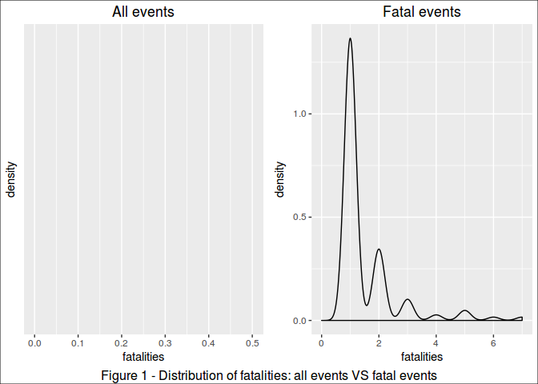

Looking at this distribution, we can infer that **95% of the fatal
occurrences caused up to 7 fattalities**.

In this study, we looked on the 5% deadliest occurrences.

    # subset for 95% CI
    fatal95.df <- fatal.df %>% filter(fatalities>qt[1])
                    
    # create color pallete for all events
    colourCount = length(unique(fatal95.df$event))
    getPalette = colorRampPalette(brewer.pal(colourCount, "Set1"))

    # print a table
    kable(fatal95.df[, c(10,1:9)])

<table>
<thead>
<tr class="header">
<th align="right">rank</th>
<th align="left">event</th>
<th align="right">mag</th>
<th align="left">day</th>
<th align="right">duration</th>
<th align="left">state</th>
<th align="left">countyname</th>
<th align="right">fatalities</th>
<th align="right">mean</th>
<th align="right">median</th>
</tr>
</thead>
<tbody>
<tr class="odd">
<td align="right">1</td>
<td align="left">HEAT|WARM</td>
<td align="right">0</td>
<td align="left">2005-07-12</td>
<td align="right">0S</td>
<td align="left">AZ</td>
<td align="left">AZZ023</td>
<td align="right">30</td>
<td align="right">1.90137</td>
<td align="right">1</td>
</tr>
<tr class="even">
<td align="right">2</td>
<td align="left">TORNADO</td>
<td align="right">0</td>
<td align="left">1990-08-28</td>
<td align="right">NA</td>
<td align="left">IL</td>
<td align="left">WILL</td>
<td align="right">29</td>
<td align="right">1.90137</td>
<td align="right">1</td>
</tr>
<tr class="odd">
<td align="right">3</td>
<td align="left">HEAT|WARM</td>
<td align="right">0</td>
<td align="left">2001-08-06</td>
<td align="right">0S</td>
<td align="left">PA</td>
<td align="left">PAZ054&gt;05</td>
<td align="right">22</td>
<td align="right">1.90137</td>
<td align="right">1</td>
</tr>
<tr class="even">
<td align="right">4</td>
<td align="left">HEAT|WARM</td>
<td align="right">0</td>
<td align="left">2011-07-17</td>
<td align="right">0S</td>
<td align="left">IL</td>
<td align="left">ILZ014</td>
<td align="right">16</td>
<td align="right">1.90137</td>
<td align="right">1</td>
</tr>
<tr class="odd">
<td align="right">5</td>
<td align="left">TORNADO</td>
<td align="right">0</td>
<td align="left">1971-02-21</td>
<td align="right">NA</td>
<td align="left">MS</td>
<td align="left">LEFLORE</td>
<td align="right">14</td>
<td align="right">1.90137</td>
<td align="right">1</td>
</tr>
<tr class="even">
<td align="right">6</td>
<td align="left">TORNADO</td>
<td align="right">0</td>
<td align="left">1965-04-11</td>
<td align="right">NA</td>
<td align="left">OH</td>
<td align="left">ALLEN</td>
<td align="right">11</td>
<td align="right">1.90137</td>
<td align="right">1</td>
</tr>
<tr class="odd">
<td align="right">7</td>
<td align="left">FLOOD</td>
<td align="right">0</td>
<td align="left">1997-08-12</td>
<td align="right">0S</td>
<td align="left">AZ</td>
<td align="left">COCONINO</td>
<td align="right">11</td>
<td align="right">1.90137</td>
<td align="right">1</td>
</tr>
<tr class="even">
<td align="right">8</td>
<td align="left">FLOOD</td>
<td align="right">0</td>
<td align="left">2010-05-01</td>
<td align="right">0S</td>
<td align="left">TN</td>
<td align="left">DAVIDSON</td>
<td align="right">10</td>
<td align="right">1.90137</td>
<td align="right">1</td>
</tr>
<tr class="odd">
<td align="right">9</td>
<td align="left">TORNADO</td>
<td align="right">0</td>
<td align="left">2011-04-27</td>
<td align="right">0S</td>
<td align="left">AL</td>
<td align="left">WALKER</td>
<td align="right">9</td>
<td align="right">1.90137</td>
<td align="right">1</td>
</tr>
</tbody>
</table>

    # prepare text for inline R
    worst.fatal.single.ev <- fatal95.df$event[1]
    worst.fatal.single.st <- fatal95.df$state[1]
    worst.fatal.single.ct <- fatal95.df$countyname[1]
    worst.fatal.single.dt <- fatal95.df$day[1]
    worst.fatal.single.kill <- fatal95.df$fatalities[1]

    # the plot
    plt.fatal.single <- ggplot(fatal95.df, aes(day, fatalities, colour=event))

    (plt.fatal.single <- plt.fatal.single + geom_point() +
            geom_text(aes(label=ifelse(rank <= 10, 
                    as.character(day),""),
                    hjust=-.03,vjust=0.5)) +                
            geom_hline(aes(yintercept = mean), linetype=2) +
            geom_hline(aes(yintercept = median), linetype=3) +
            labs(title="Most Fatal Events in a Single Occurrence",
                        y="Fatalities", x="Ocurrence Date") +
        
            expand_limits(x=as.Date('2017-01-01'))+ #ok
            scale_colour_manual(values = getPalette(colourCount))+                
            theme(legend.title=element_blank()) +
            theme(legend.position="bottom") +
            guides(fill=guide_legend(nrow=5, byrow=TRUE)) +
            theme(axis.text.x = element_text(angle = 90, hjust = 1)) + 
            theme(plot.title = element_text(hjust = 0.5))                 
    )  

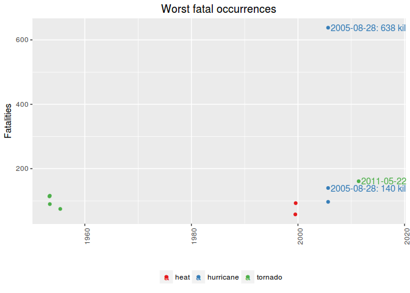

The single most fatal event was a **HEAT|WARM, that occurred in AZ,
AZZ023, on 2005-07-12, killing 30 people.**

However, if we compare this single awful event to the mean of fatalities
caused, we see that this is very unlikely to happen.

### Most fatal in all time

Most fatal in all time

Notice that are several occurrences of the same type of event along the
time.

Therefore, in order to know which is the worst type of event along all
the years, we summed up the fatalities caused by each one of occurrences
of this events.

Notice that we are interested only in the worst of them, ie, the ones
which are above the mean.

    # totals per event
    fatal.all.df <- fatal.df %>% group_by(event) %>%
            summarise(total = sum(fatalities)) %>% arrange(desc(total)) %>% 
            mutate(mean = mean(total), median = median(total),
                   rank = seq_len(length(event))) %>%
            filter(total > mean(total))

    # create color pallete for all events
    colourCount = length(unique(fatal.all.df$event))
    getPalette = colorRampPalette(brewer.pal(colourCount, "Set1"))

    # prepare text for inline R
    worst.fatal.all.ev <- fatal.all.df$event[1]
    worst.fatal.all.kill <- fatal.all.df$total[1]

    # a table
    kable(fatal.all.df[,c(5,1:4)])

<table>
<thead>
<tr class="header">
<th align="right">rank</th>
<th align="left">event</th>
<th align="right">total</th>
<th align="right">mean</th>
<th align="right">median</th>
</tr>
</thead>
<tbody>
<tr class="odd">
<td align="right">1</td>
<td align="left">TORNADO</td>
<td align="right">219</td>
<td align="right">34.7</td>
<td align="right">10</td>
</tr>
<tr class="even">
<td align="right">2</td>
<td align="left">HEAT|WARM</td>
<td align="right">134</td>
<td align="right">34.7</td>
<td align="right">10</td>
</tr>
<tr class="odd">
<td align="right">3</td>
<td align="left">FLOOD</td>
<td align="right">85</td>
<td align="right">34.7</td>
<td align="right">10</td>
</tr>
<tr class="even">
<td align="right">4</td>
<td align="left">WIND</td>
<td align="right">69</td>
<td align="right">34.7</td>
<td align="right">10</td>
</tr>
<tr class="odd">
<td align="right">5</td>
<td align="left">LIGHTNING</td>
<td align="right">51</td>
<td align="right">34.7</td>
<td align="right">10</td>
</tr>
</tbody>
</table>

    # the plot
    plt.fatal.all <- ggplot(data=fatal.all.df, aes(event, total, fill=event))

    (plt.fatal.all <- plt.fatal.all + geom_bar(stat="identity") +
         
            geom_text(aes(label=ifelse(total==max(total),
                    paste(event, max(total), sep=": "),'')),
                    hjust=0,vjust=2) +
            geom_hline(aes(yintercept = mean), linetype=1) +
            geom_hline(aes(yintercept = median), linetype=2) +
            labs(title="Most Fatal events - all time", y="Fatalities",
                 x="") + 
                    
            theme(legend.position="none") +        
            scale_colour_manual(values = getPalette(colourCount))+                
            theme(legend.title=element_blank()) +
            theme(axis.text.x = element_text(angle = 90, hjust = 1)) + 
            theme(plot.title = element_text(hjust = 0.5))                 
                    
                    
    )  

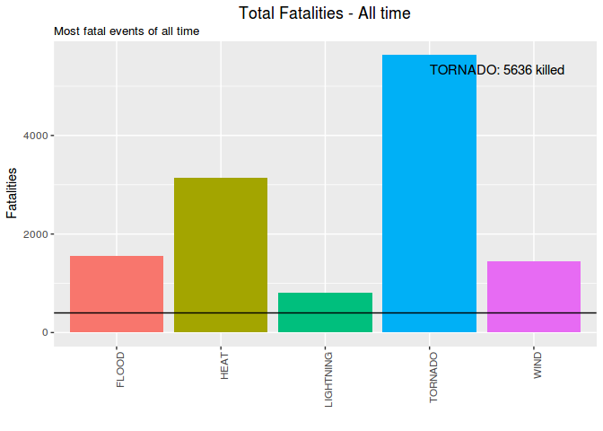

The most fatal event along the time is the **TORNADO. It has killed 219
people until now.**

Just for curiosity, these are the less fatal among the fatal events:

    # sort for less dangerous, had to subset again due to previous filtering
    fatal.all.df <- fatal.df %>% group_by(event) %>%
            summarise(total = sum(fatalities)) %>% arrange(total) %>% 
            mutate(mean = mean(total), median = median(total),
                   rank = seq(length(event),1, by=-1))

    # a table
    kable(fatal.all.df[1:10,c(5,1:2)])

<table>
<thead>
<tr class="header">
<th align="right">rank</th>
<th align="left">event</th>
<th align="right">total</th>
</tr>
</thead>
<tbody>
<tr class="odd">
<td align="right">20</td>
<td align="left">FOG</td>
<td align="right">1</td>
</tr>
<tr class="even">
<td align="right">19</td>
<td align="left">WINTER WEATHER/MIX</td>
<td align="right">1</td>
</tr>
<tr class="odd">
<td align="right">18</td>
<td align="left">URBAN/SML STREAM FLD</td>
<td align="right">3</td>
</tr>
<tr class="even">
<td align="right">17</td>
<td align="left">WINTER WEATHER</td>
<td align="right">3</td>
</tr>
<tr class="odd">
<td align="right">16</td>
<td align="left">FIRE</td>
<td align="right">6</td>
</tr>
<tr class="even">
<td align="right">15</td>
<td align="left">RAIN|PRECIP</td>
<td align="right">7</td>
</tr>
<tr class="odd">
<td align="right">14</td>
<td align="left">SNOW</td>
<td align="right">8</td>
</tr>
<tr class="even">
<td align="right">13</td>
<td align="left">COLD|FREEZ</td>
<td align="right">9</td>
</tr>
<tr class="odd">
<td align="right">12</td>
<td align="left">BLIZZARD</td>
<td align="right">10</td>
</tr>
<tr class="even">
<td align="right">11</td>
<td align="left">HURRICANE</td>
<td align="right">10</td>
</tr>
</tbody>
</table>

### Injuring Occurrences

### Most injuring in a single occurrence

Most injuring in a single occurrence

In order to determine what were the most injuring events in a single
occurrence, we need to see how injuries are distributed along the
occurrences.

    rm(fatal.df,fatal.all.df, fatal95.df, qt) # cleannig house

    injuring.df <- harm.df %>% filter(!is.na(injuries)) %>%
                    select(1:6,8)

    # quantiles
    qt <- quantile(injuring.df$injuries, probs=seq(.975,1,0.002))

    # distribution plot
    plt.distr.inj0 <- ggplot(injuring.df, aes(injuries))

    plt.distr.inj0 <- plt.distr.inj0 + geom_density(aes(y=..density..)) + xlim(0,0.5) + 
            labs(title="All events") +
            theme(plot.title = element_text(hjust = 0.5))

    # display only the qts next to injuring events
    qt[(length(qt)-(length(qt[qt>=1])+1)): length(qt)]

    ## 97.9% 98.1% 98.3% 98.5% 98.7% 98.9% 99.1% 99.3% 99.5% 99.7% 99.9% 
    ##     0     0     1     1     1     1     2     3     4     7    22

Looking at this distribution, we can infer that the vast majority of
those occurrences were not injuring at all: **98.1% occurrences didn't
caused any injuries**

On the other hand, injuring occurrences had to have at least 1 injury.

Now, among the injuring occurrences, we are interested in the ones whose
harm is beyond the confidence interval, ie. above 95% of the most common
values.

    # subset for harm events
    injuring.df <- injuring.df %>% filter(injuries > 0) %>%
                    arrange(desc(injuries)) %>%
                    mutate(mean = mean(injuries), 
                    median = median(injuries),
                    rank = seq_len(length(event)))

    # quantiles, same as 
    # poisson.test(mean, conf.level = 0.95)

    qt <- quantile(injuring.df$injuries, probs=seq(.975,1,0.005))
    qt

    ##  97.5%    98%  98.5%    99%  99.5%   100% 
    ##  42.60  50.84  59.84  98.92 133.20 350.00

Distribution plots

    # distribution plot
    plt.distr.inj1 <- ggplot(injuring.df, aes(injuries))

    plt.distr.inj1 <- plt.distr.inj1 + geom_density(aes(y=..density..)) + xlim(0,qt[1]) + 
            labs(title="Injuring events") +
            theme(plot.title = element_text(hjust = 0.5))       

    grid.arrange(plt.distr.inj0, plt.distr.inj1, nrow=1, ncol=2, 
                 bottom="Figure 2 - Distribution of Injuries: all events VS injuring events")
    grid.rect(gp=gpar(fill=NA))

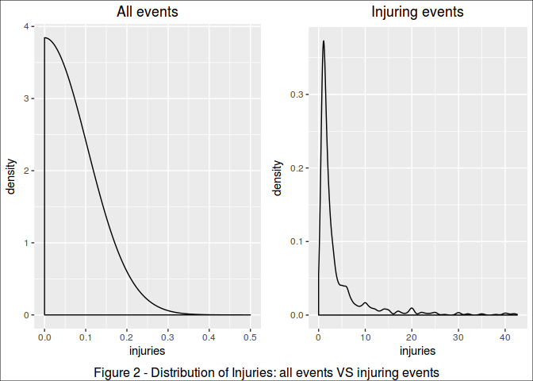

Looking at this distribution, we can infer that **95% of the injuring
occurrences caused up to 42.6 injuries**.

In this study, we looked on the 5% most injuring occurrences.

    # subset for 95% CI
    injuring95.df <- filter(injuring.df, injuries>qt[1])

    # create color pallete for all events
    colourCount = length(unique(injuring95.df$event))
    getPalette = colorRampPalette(brewer.pal(colourCount, "Set1"))

    # print a table
    kable(injuring95.df[,c(10,1:9)])

<table>
<thead>
<tr class="header">
<th align="right">rank</th>
<th align="left">event</th>
<th align="right">mag</th>
<th align="left">day</th>
<th align="right">duration</th>
<th align="left">state</th>
<th align="left">countyname</th>
<th align="right">injuries</th>
<th align="right">mean</th>
<th align="right">median</th>
</tr>
</thead>
<tbody>
<tr class="odd">
<td align="right">1</td>
<td align="left">TORNADO</td>
<td align="right">0</td>
<td align="left">1990-08-28</td>
<td align="right">NA</td>
<td align="left">IL</td>
<td align="left">WILL</td>
<td align="right">350</td>
<td align="right">6.691569</td>
<td align="right">2</td>
</tr>
<tr class="even">
<td align="right">2</td>
<td align="left">TORNADO</td>
<td align="right">0</td>
<td align="left">1984-03-28</td>
<td align="right">NA</td>
<td align="left">NC</td>
<td align="left">ROBESON</td>
<td align="right">280</td>
<td align="right">6.691569</td>
<td align="right">2</td>
</tr>
<tr class="odd">
<td align="right">3</td>
<td align="left">TORNADO</td>
<td align="right">0</td>
<td align="left">1971-02-21</td>
<td align="right">NA</td>
<td align="left">MS</td>
<td align="left">LEFLORE</td>
<td align="right">192</td>
<td align="right">6.691569</td>
<td align="right">2</td>
</tr>
<tr class="even">
<td align="right">4</td>
<td align="left">TORNADO</td>
<td align="right">0</td>
<td align="left">1974-04-03</td>
<td align="right">NA</td>
<td align="left">OH</td>
<td align="left">HAMILTON</td>
<td align="right">190</td>
<td align="right">6.691569</td>
<td align="right">2</td>
</tr>
<tr class="odd">
<td align="right">5</td>
<td align="left">HEAT|WARM</td>
<td align="right">0</td>
<td align="left">2011-06-13</td>
<td align="right">0S</td>
<td align="left">TX</td>
<td align="left">TXZ119</td>
<td align="right">140</td>
<td align="right">6.691569</td>
<td align="right">2</td>
</tr>
<tr class="even">
<td align="right">6</td>
<td align="left">TORNADO</td>
<td align="right">0</td>
<td align="left">1956-04-03</td>
<td align="right">NA</td>
<td align="left">MI</td>
<td align="left">KENT</td>
<td align="right">130</td>
<td align="right">6.691569</td>
<td align="right">2</td>
</tr>
<tr class="odd">
<td align="right">7</td>
<td align="left">TORNADO</td>
<td align="right">0</td>
<td align="left">1971-02-07</td>
<td align="right">NA</td>
<td align="left">FL</td>
<td align="left">ESCAMBIA</td>
<td align="right">112</td>
<td align="right">6.691569</td>
<td align="right">2</td>
</tr>
<tr class="even">
<td align="right">8</td>
<td align="left">TORNADO</td>
<td align="right">0</td>
<td align="left">1974-04-03</td>
<td align="right">NA</td>
<td align="left">AL</td>
<td align="left">MADISON</td>
<td align="right">110</td>
<td align="right">6.691569</td>
<td align="right">2</td>
</tr>
<tr class="odd">
<td align="right">9</td>
<td align="left">TORNADO</td>
<td align="right">0</td>
<td align="left">1965-04-11</td>
<td align="right">NA</td>
<td align="left">OH</td>
<td align="left">ALLEN</td>
<td align="right">100</td>
<td align="right">6.691569</td>
<td align="right">2</td>
</tr>
<tr class="even">
<td align="right">10</td>
<td align="left">TORNADO</td>
<td align="right">0</td>
<td align="left">2000-09-20</td>
<td align="right">0S</td>
<td align="left">OH</td>
<td align="left">GREENE</td>
<td align="right">100</td>
<td align="right">6.691569</td>
<td align="right">2</td>
</tr>
<tr class="odd">
<td align="right">11</td>
<td align="left">TORNADO</td>
<td align="right">0</td>
<td align="left">2002-09-20</td>
<td align="right">0S</td>
<td align="left">IN</td>
<td align="left">MARION</td>
<td align="right">97</td>
<td align="right">6.691569</td>
<td align="right">2</td>
</tr>
<tr class="even">
<td align="right">12</td>
<td align="left">WIND</td>
<td align="right">0</td>
<td align="left">1993-10-26</td>
<td align="right">0S</td>
<td align="left">CA</td>
<td align="left">CAZ011 -</td>
<td align="right">89</td>
<td align="right">6.691569</td>
<td align="right">2</td>
</tr>
<tr class="odd">
<td align="right">13</td>
<td align="left">TORNADO</td>
<td align="right">0</td>
<td align="left">1973-05-27</td>
<td align="right">NA</td>
<td align="left">AL</td>
<td align="left">HALE</td>
<td align="right">72</td>
<td align="right">6.691569</td>
<td align="right">2</td>
</tr>
<tr class="even">
<td align="right">14</td>
<td align="left">TORNADO</td>
<td align="right">0</td>
<td align="left">2011-04-16</td>
<td align="right">0S</td>
<td align="left">NC</td>
<td align="left">WAKE</td>
<td align="right">67</td>
<td align="right">6.691569</td>
<td align="right">2</td>
</tr>
<tr class="odd">
<td align="right">15</td>
<td align="left">STORM</td>
<td align="right">0</td>
<td align="left">1997-03-31</td>
<td align="right">0S</td>
<td align="left">UT</td>
<td align="left">UTZ001&gt;00</td>
<td align="right">60</td>
<td align="right">6.691569</td>
<td align="right">2</td>
</tr>
<tr class="even">
<td align="right">16</td>
<td align="left">STORM</td>
<td align="right">0</td>
<td align="left">1999-01-02</td>
<td align="right">0S</td>
<td align="left">OH</td>
<td align="left">OHZ003 -</td>
<td align="right">56</td>
<td align="right">6.691569</td>
<td align="right">2</td>
</tr>
<tr class="odd">
<td align="right">17</td>
<td align="left">SURF</td>
<td align="right">0</td>
<td align="left">2008-07-11</td>
<td align="right">0S</td>
<td align="left">DE</td>
<td align="left">DEZ004</td>
<td align="right">55</td>
<td align="right">6.691569</td>
<td align="right">2</td>
</tr>
<tr class="even">
<td align="right">18</td>
<td align="left">TORNADO</td>
<td align="right">0</td>
<td align="left">1965-05-08</td>
<td align="right">NA</td>
<td align="left">NE</td>
<td align="left">BOONE</td>
<td align="right">53</td>
<td align="right">6.691569</td>
<td align="right">2</td>
</tr>
<tr class="odd">
<td align="right">19</td>
<td align="left">WIND</td>
<td align="right">0</td>
<td align="left">1998-05-31</td>
<td align="right">0S</td>
<td align="left">MI</td>
<td align="left">KENT</td>
<td align="right">53</td>
<td align="right">6.691569</td>
<td align="right">2</td>
</tr>
<tr class="even">
<td align="right">20</td>
<td align="left">FLOOD</td>
<td align="right">0</td>
<td align="left">1998-08-23</td>
<td align="right">0S</td>
<td align="left">TX</td>
<td align="left">TXZ185 -</td>
<td align="right">50</td>
<td align="right">6.691569</td>
<td align="right">2</td>
</tr>
<tr class="odd">
<td align="right">21</td>
<td align="left">TORNADO</td>
<td align="right">0</td>
<td align="left">2011-04-27</td>
<td align="right">1d 0H 0M 0S</td>
<td align="left">AL</td>
<td align="left">MARSHALL</td>
<td align="right">48</td>
<td align="right">6.691569</td>
<td align="right">2</td>
</tr>
<tr class="even">
<td align="right">22</td>
<td align="left">HEAT|WARM</td>
<td align="right">0</td>
<td align="left">2004-07-09</td>
<td align="right">0S</td>
<td align="left">MO</td>
<td align="left">MOZ061 -</td>
<td align="right">45</td>
<td align="right">6.691569</td>
<td align="right">2</td>
</tr>
<tr class="odd">
<td align="right">23</td>
<td align="left">TORNADO</td>
<td align="right">0</td>
<td align="left">1977-04-02</td>
<td align="right">NA</td>
<td align="left">MI</td>
<td align="left">EATON</td>
<td align="right">44</td>
<td align="right">6.691569</td>
<td align="right">2</td>
</tr>
<tr class="even">
<td align="right">24</td>
<td align="left">TORNADO</td>
<td align="right">0</td>
<td align="left">1997-11-21</td>
<td align="right">0S</td>
<td align="left">LA</td>
<td align="left">ST. TAMMA</td>
<td align="right">43</td>
<td align="right">6.691569</td>
<td align="right">2</td>
</tr>
</tbody>
</table>

    # prepare text for inline R
    worst.injuring.single.ev <- injuring95.df$event[1]
    worst.injuring.single.st <- injuring95.df$state[1]
    worst.injuring.single.ct <- injuring95.df$countyname[1]
    worst.injuring.single.dt <- injuring95.df$day[1]
    worst.injuring.single.inj <- injuring95.df$injuries[1]

    # the plot
    plt.inj.single <- ggplot(injuring95.df, aes(day, injuries, colour=event))

    (plt.inj.single <- plt.inj.single + geom_point() +
            geom_text(aes(label=ifelse(rank <= 10,
                    as.character(day),""),
                    hjust=-.03,vjust=0.5)) +
            geom_hline(aes(yintercept = mean), linetype=2) +
            geom_hline(aes(yintercept = median), linetype=3) +
            labs(title="Most Injuring Events in a Single Occurrence",
                        y="Injuries", x="Ocurrence Date") +
                    
            expand_limits(x=as.Date('2017-01-01'))+ #ok
            scale_colour_manual(values = getPalette(colourCount))+                
            theme(legend.title=element_blank()) +
            theme(legend.position="bottom") +
            guides(fill=guide_legend(nrow=5, byrow=TRUE)) +
            theme(axis.text.x = element_text(angle = 90, hjust = 1)) + 
            theme(plot.title = element_text(hjust = 0.5)) 

    )  

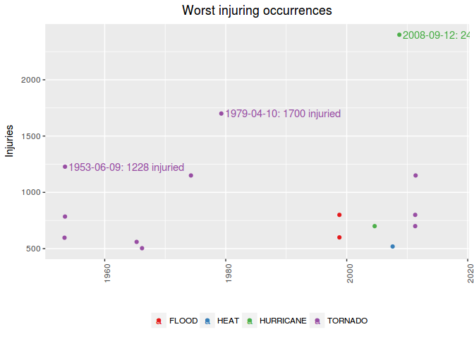

The single most injuring event was a **TORNADO, that occurred in IL,
WILL, on 1990-08-28, injuring 350 people.**

However, if we compare this single awful event to the mean of injuries
caused, we see that this is very unlikely to happen.

### Most injuring in all time

Most injuring in all time

Notice that are several occurrences of the same type of event along the
time.

Therefore, in order to know which is the worst type of event along all
the years, we summed up the injuries caused by each one of occurrences
of this events.

Notice that we are interested only in the worst of them, ie, the ones
which are above the mean.

    # totals per event
    injuring.all.df <- injuring.df %>% group_by(event) %>% 
            summarise(total = sum(injuries)) %>%
            arrange(desc(total)) %>% 
            mutate(mean = mean(total), median = median(total),
                   rank = seq_len(length(event)))  %>%
            filter(total >= mean(total))

    # create color pallete for all events
    colourCount = length(unique(injuring.all.df$event))
    getPalette = colorRampPalette(brewer.pal(colourCount, "Set1"))

    # prepare text for inline R
    worst.injuring.all.ev <- injuring.all.df$event[1]
    worst.injuring.all.inj <- injuring.all.df$total[1]

    # a table
    kable(injuring.all.df[,c(5,1:4)])

<table>
<thead>
<tr class="header">
<th align="right">rank</th>
<th align="left">event</th>
<th align="right">total</th>
<th align="right">mean</th>
<th align="right">median</th>
</tr>
</thead>
<tbody>
<tr class="odd">
<td align="right">1</td>
<td align="left">TORNADO</td>
<td align="right">4146</td>
<td align="right">285</td>
<td align="right">33</td>
</tr>
<tr class="even">
<td align="right">2</td>
<td align="left">WIND</td>
<td align="right">662</td>
<td align="right">285</td>
<td align="right">33</td>
</tr>
<tr class="odd">
<td align="right">3</td>
<td align="left">LIGHTNING</td>
<td align="right">334</td>
<td align="right">285</td>
<td align="right">33</td>
</tr>
<tr class="even">
<td align="right">4</td>
<td align="left">HEAT|WARM</td>
<td align="right">300</td>
<td align="right">285</td>
<td align="right">33</td>
</tr>
</tbody>
</table>

The most injuring event along the time is the **TORNADO. It has injuried
4146 people until now.**

    # the plot
    plt.inj.all <- ggplot(data=injuring.all.df, aes(event, total, fill=event))

    (plt.inj.all <- plt.inj.all + geom_bar(stat="identity") +
         
            geom_text(aes(label=ifelse(total==max(total),
                    paste(event, max(total), sep=": "),'')),
                    hjust=0,vjust=2) +
            geom_hline(aes(yintercept = mean), linetype=1) +
            geom_hline(aes(yintercept = median), linetype=2) +
            labs(title="Most Injuring events - all time", 
                 y="Injuries", x="") + 
                    
            theme(legend.position="none") +        
            scale_colour_manual(values = getPalette(colourCount))+                
            theme(legend.title=element_blank()) +
            theme(axis.text.x = element_text(angle = 90, hjust = 1)) + 
            theme(plot.title = element_text(hjust = 0.5))                 
                    
    )

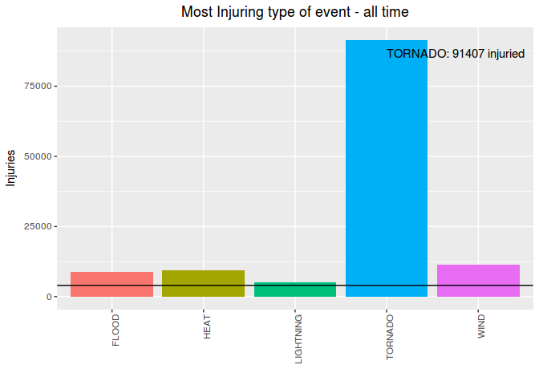

Just for curiosity, lets show now what are the less injuring among the
injuring events:

    # sort for less dangerous, had to subset again due to previous filtering
    injuring.all.df <- injuring.df %>% group_by(event) %>%
            summarise(total = sum(injuries)) %>% arrange(total) %>% 
            mutate(mean = mean(total), median = median(total),
                   rank = seq(length(event),1, by=-1))

    # a table
    kable(injuring.all.df[1:10,c(5,1:2)])

<table>
<thead>
<tr class="header">
<th align="right">rank</th>
<th align="left">event</th>
<th align="right">total</th>
</tr>
</thead>
<tbody>
<tr class="odd">
<td align="right">22</td>
<td align="left">HURRICANE</td>
<td align="right">1</td>
</tr>
<tr class="even">
<td align="right">21</td>
<td align="left">DUST DEVIL</td>
<td align="right">2</td>
</tr>
<tr class="odd">
<td align="right">20</td>
<td align="left">WINTER WEATHER/MIX</td>
<td align="right">3</td>
</tr>
<tr class="even">
<td align="right">19</td>
<td align="left">URBAN/SML STREAM FLD</td>
<td align="right">4</td>
</tr>
<tr class="odd">
<td align="right">18</td>
<td align="left">BLIZZARD</td>
<td align="right">5</td>
</tr>
<tr class="even">
<td align="right">17</td>
<td align="left">RAIN|PRECIP</td>
<td align="right">8</td>
</tr>
<tr class="odd">
<td align="right">16</td>
<td align="left">RIP CURRENT</td>
<td align="right">11</td>
</tr>
<tr class="even">
<td align="right">15</td>
<td align="left">AVALANCHE</td>
<td align="right">14</td>
</tr>
<tr class="odd">
<td align="right">14</td>
<td align="left">COLD|FREEZ</td>
<td align="right">15</td>
</tr>
<tr class="even">
<td align="right">13</td>
<td align="left">WINTER WEATHER</td>
<td align="right">21</td>
</tr>
</tbody>
</table>

Economy: the the most harmfull events
-------------------------------------

We have determined what events did more harm to economy, both in terms
of property and crops damage.

There were events that causes zero property damage but a lot of crop
damage. The inverse is also true, so we did a separate analysis to
property VS crop damaging events.

### Property losses

### Most Property Damaging event in a single occurrence

Most Property Damaging event in a single occurrence

In order to determine what were the most property damaging events in a
single occurrence, we need to see how damages are distributed along the
occurrences.

    # property damages
    rm(injuring.df, injuring.all.df, injuring95.df) # cleannig house

    prop.df <- harm.df %>% filter(!is.na(prop.ev)) %>%
                            select(1:6,13)
                    

    # quantiles
    qt <- quantile(prop.df$prop.ev, probs=seq(.975,1,0.002))

    # distribution plot
    plt.distr.prop0 <- ggplot(prop.df, aes(log(prop.ev)))

    plt.distr.prop0 <- plt.distr.prop0 + geom_density(aes(y=..density..)) + #xlim(0,.5) + 
            labs(title="All events", x="log(amount $)") +
            theme(plot.title = element_text(hjust = 0.5))       

    # display only the qts next to harmfull events
    qt

    ##    97.5%    97.7%    97.9%    98.1%    98.3%    98.5%    98.7%    98.9% 
    ##   800000  1000000  1100000  1600000  2000000  2500000  2500000  2500000 
    ##    99.1%    99.3%    99.5%    99.7%    99.9% 
    ##  3500000  5000000 10000000 25000000 75000000

Looking at this distribution, we can infer that 95% of the occurrences
caused less than **$800,000 in losses**.

On the other hand, damaging occurrences had to have damages above zero.

Now, among the damaging occurrences, we are interested in the ones whose
damages are beyond the confidence interval, ie. above 95% of the most
common values.

    # subset for harm events
    prop.df <- prop.df %>% filter(prop.ev > 0) %>%
                    arrange(desc(prop.ev)) %>%
                    mutate(value = dollar(prop.ev),
                            media.raw = mean(prop.ev), 
                            mediana.raw = median(prop.ev),
                            mean = dollar(media.raw),
                            median = dollar(mediana.raw),
                            rank = seq_len(length(event)))
    # quantiles, same as 

    qt <- quantile(prop.df$prop.ev, probs=seq(.999,1,0.002))
    qt

    ##     99.9% 
    ## 132280000

Distribution plots

    # distribution plot
    plt.distr.prop1 <- ggplot(prop.df, aes(log(prop.ev)))

    plt.distr.prop1 <- plt.distr.prop1 + geom_density(aes(y=..density..)) + #xlim(0,100) + 
            labs(title="Damaging events", x="log(amount $)") +
            theme(plot.title = element_text(hjust = 0.5))     

    grid.arrange(plt.distr.prop0, plt.distr.prop1, nrow=1, ncol=2, 
                 bottom="Figure - Distribution of Losses: all events VS damaging events")
    grid.rect(gp=gpar(fill=NA)) 

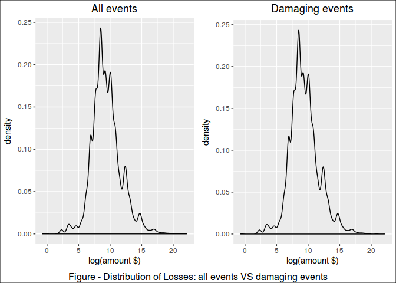

Looking at this distribution, we can infer that **95% of the damaging
occurrences caused up to $132,280,000 in losses**.

In this study, we looked on the 0,1% most harmful occurrences.

    # subset for 95% CI
    prop95.df <- filter(prop.df, prop.ev>qt[1])

    # create color pallete for all events
    colourCount = length(unique(prop95.df$event))
    getPalette = colorRampPalette(brewer.pal(colourCount, "Set1"))

    # print a table
    kable(prop95.df[,c(13,1:6,8,11:12)])

<table>
<thead>
<tr class="header">
<th align="right">rank</th>
<th align="left">event</th>
<th align="right">mag</th>
<th align="left">day</th>
<th align="right">duration</th>
<th align="left">state</th>
<th align="left">countyname</th>
<th align="left">value</th>
<th align="left">mean</th>
<th align="left">median</th>
</tr>
</thead>
<tbody>
<tr class="odd">
<td align="right">1</td>
<td align="left">HURRICANE</td>
<td align="right">0</td>
<td align="left">2004-09-13</td>
<td align="right">0S</td>
<td align="left">FL</td>
<td align="left">FLZ001&gt;00</td>
<td align="left">$4,000,000,000</td>
<td align="left">$1,085,341</td>
<td align="left">$10,000</td>
</tr>
<tr class="even">
<td align="right">2</td>
<td align="left">FLOOD</td>
<td align="right">0</td>
<td align="left">2010-05-01</td>
<td align="right">0S</td>
<td align="left">TN</td>
<td align="left">DAVIDSON</td>
<td align="left">$1,500,000,000</td>
<td align="left">$1,085,341</td>
<td align="left">$10,000</td>
</tr>
<tr class="odd">
<td align="right">3</td>
<td align="left">WIND</td>
<td align="right">94</td>
<td align="left">2004-08-13</td>
<td align="right">0S</td>
<td align="left">FL</td>
<td align="left">FLZ052 -</td>
<td align="left">$929,000,000</td>
<td align="left">$1,085,341</td>
<td align="left">$10,000</td>
</tr>
<tr class="even">
<td align="right">4</td>
<td align="left">WIND</td>
<td align="right">0</td>
<td align="left">1993-10-26</td>
<td align="right">0S</td>
<td align="left">CA</td>
<td align="left">CAZ011 -</td>
<td align="left">$331,000,000</td>
<td align="left">$1,085,341</td>
<td align="left">$10,000</td>
</tr>
<tr class="odd">
<td align="right">5</td>
<td align="left">STORM</td>
<td align="right">0</td>
<td align="left">1998-09-07</td>
<td align="right">0S</td>
<td align="left">TX</td>
<td align="left">TXZ163&gt;16</td>
<td align="left">$287,180,000</td>
<td align="left">$1,085,341</td>
<td align="left">$10,000</td>
</tr>
<tr class="even">
<td align="right">6</td>
<td align="left">FLOOD</td>
<td align="right">0</td>
<td align="left">2010-07-24</td>
<td align="right">0S</td>
<td align="left">IL</td>
<td align="left">COOK</td>
<td align="left">$253,380,000</td>
<td align="left">$1,085,341</td>
<td align="left">$10,000</td>
</tr>
<tr class="odd">
<td align="right">7</td>
<td align="left">TORNADO</td>
<td align="right">0</td>
<td align="left">1973-03-31</td>
<td align="right">NA</td>
<td align="left">GA</td>
<td align="left">OCONEE</td>
<td align="left">$250,000,000</td>
<td align="left">$1,085,341</td>
<td align="left">$10,000</td>
</tr>
<tr class="even">
<td align="right">8</td>
<td align="left">TORNADO</td>
<td align="right">0</td>
<td align="left">1980-06-03</td>
<td align="right">NA</td>
<td align="left">PA</td>
<td align="left">ALLEGHENY</td>
<td align="left">$250,000,000</td>
<td align="left">$1,085,341</td>
<td align="left">$10,000</td>
</tr>
<tr class="odd">
<td align="right">9</td>
<td align="left">TORNADO</td>
<td align="right">0</td>
<td align="left">1990-08-28</td>
<td align="right">NA</td>
<td align="left">IL</td>
<td align="left">WILL</td>
<td align="left">$250,000,000</td>
<td align="left">$1,085,341</td>
<td align="left">$10,000</td>
</tr>
<tr class="even">
<td align="right">10</td>
<td align="left">HAIL</td>
<td align="right">450</td>
<td align="left">1996-04-19</td>
<td align="right">0S</td>
<td align="left">TX</td>
<td align="left">BELL</td>
<td align="left">$200,000,000</td>
<td align="left">$1,085,341</td>
<td align="left">$10,000</td>
</tr>
<tr class="odd">
<td align="right">11</td>
<td align="left">FLOOD</td>
<td align="right">0</td>
<td align="left">2011-09-07</td>
<td align="right">0S</td>
<td align="left">NY</td>
<td align="left">BROOME</td>
<td align="left">$170,000,000</td>
<td align="left">$1,085,341</td>
<td align="left">$10,000</td>
</tr>
<tr class="even">
<td align="right">12</td>
<td align="left">FLOOD</td>
<td align="right">0</td>
<td align="left">2000-08-12</td>
<td align="right">0S</td>
<td align="left">NJ</td>
<td align="left">SUSSEX</td>
<td align="left">$166,500,000</td>
<td align="left">$1,085,341</td>
<td align="left">$10,000</td>
</tr>
<tr class="odd">
<td align="right">13</td>
<td align="left">FIRE</td>
<td align="right">0</td>
<td align="left">1998-07-01</td>
<td align="right">0S</td>
<td align="left">FL</td>
<td align="left">VOLUSIA</td>
<td align="left">$150,000,000</td>
<td align="left">$1,085,341</td>
<td align="left">$10,000</td>
</tr>
<tr class="even">
<td align="right">14</td>
<td align="left">HURRICANE</td>
<td align="right">0</td>
<td align="left">1998-09-25</td>
<td align="right">0S</td>
<td align="left">FL</td>
<td align="left">FLZ001&gt;00</td>
<td align="left">$135,000,000</td>
<td align="left">$1,085,341</td>
<td align="left">$10,000</td>
</tr>
</tbody>
</table>

    # prepare text for inline R
    worst.prop.single.ev <- prop95.df$event[1]
    worst.prop.single.st <- prop95.df$state[1]
    worst.prop.single.ct <- prop95.df$countyname[1]
    worst.prop.single.dt <- prop95.df$day[1]
    worst.prop.single.value <- prop95.df$value[1]

    plt.prop.single <- ggplot(prop95.df, aes(day, prop.ev, colour=event))

    (plt.prop.single <- plt.prop.single + geom_point() +
            geom_text(aes(label=ifelse(rank <= 10,
                    as.character(day),""),
                    hjust=-.03,vjust=0.5)) +
            geom_hline(aes(yintercept = media.raw), linetype=2) +
             geom_hline(aes(yintercept = mediana.raw), linetype=3) +
            labs(title="Most Property Dammaging Events in a Single Occurrence",
                        y="Damages", x="") + 
                    
            expand_limits(x=as.Date('2017-01-01'))+ #ok
            scale_y_continuous(labels = dollar)+
            
            scale_colour_manual(values = getPalette(colourCount))+                
            theme(legend.title=element_blank()) +
            theme(legend.position="bottom") +
            guides(fill=guide_legend(nrow=5, byrow=TRUE)) +
            theme(axis.text.x = element_text(angle = 90, hjust = 1)) + 
            theme(plot.title = element_text(hjust = 0.5)) 
    )  

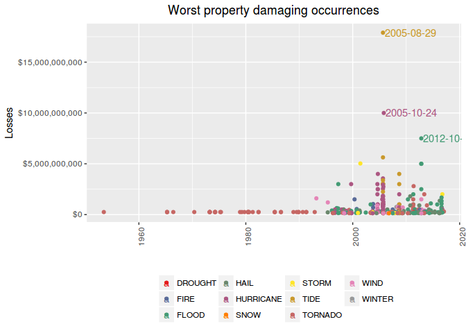

The single most economic damaging event to properties was a **HURRICANE,
that occurred in FL, FLZ001&gt;00, on 2004-09-13, causing U$
$4,000,000,000 in losses**.

### Most Property Damaging event in all time

Most Property Damaging event in all time

Notice that are several occurrences of the same type of event along the
time.

Therefore, in order to know which is the worst type of event along all
the years, we summed up the losses caused by each one of occurrences of
this events.

Notice that we are interested only in the worst of them, ie, the ones
which are above the mean.

    # totals per event
    prop.all.df <- prop.df %>% group_by(event) %>%
                    summarise(total.raw = sum(prop.ev)) %>%
                    arrange(desc(total.raw)) %>%
                    mutate(media.raw = mean(total.raw), 
                            mediana.raw = median(total.raw),
                            total = dollar(total.raw),
                            mean = dollar(media.raw),
                            median = dollar(mediana.raw),
                            rank = seq_len(length(event))) %>%
                    filter(total.raw > mean(total.raw))
                    
    # create color pallete for all events
    colourCount = length(unique(prop.all.df$event))
    getPalette = colorRampPalette(brewer.pal(colourCount, "Set1"))

    # prepare text for inline R
    worst.prop.all.ev <- prop.all.df$event[1]
    worst.prop.total <- prop.all.df$total[1]

    # a table
    kable(prop.all.df[, c(8,1,5:7)])

<table>
<thead>
<tr class="header">
<th align="right">rank</th>
<th align="left">event</th>
<th align="left">total</th>
<th align="left">mean</th>
<th align="left">median</th>
</tr>
</thead>
<tbody>
<tr class="odd">
<td align="right">1</td>
<td align="left">HURRICANE</td>
<td align="left">$4,451,850,000</td>
<td align="left">$576,229,411</td>
<td align="left">$5,740,000</td>
</tr>
<tr class="even">
<td align="right">2</td>
<td align="left">FLOOD</td>
<td align="left">$3,312,490,770</td>
<td align="left">$576,229,411</td>
<td align="left">$5,740,000</td>
</tr>
<tr class="odd">
<td align="right">3</td>
<td align="left">TORNADO</td>
<td align="left">$2,722,436,940</td>
<td align="left">$576,229,411</td>
<td align="left">$5,740,000</td>
</tr>
<tr class="even">
<td align="right">4</td>
<td align="left">WIND</td>
<td align="left">$1,906,067,665</td>
<td align="left">$576,229,411</td>
<td align="left">$5,740,000</td>
</tr>
<tr class="odd">
<td align="right">5</td>
<td align="left">STORM</td>
<td align="left">$797,084,200</td>
<td align="left">$576,229,411</td>
<td align="left">$5,740,000</td>
</tr>
<tr class="even">
<td align="right">6</td>
<td align="left">HAIL</td>
<td align="left">$793,153,761</td>
<td align="left">$576,229,411</td>
<td align="left">$5,740,000</td>
</tr>
</tbody>
</table>

    plt.prop.all <- ggplot(data=prop.all.df, aes(event, total.raw, fill=event))

    (plt.prop.all <- plt.prop.all + geom_bar(stat="identity") +
                    
            geom_text(aes(label=ifelse(total.raw==max(total.raw),
                    paste(event, dollar(max(total.raw)), sep=": "),'')),
                    hjust=0,vjust=2) +
            geom_hline(aes(yintercept = media.raw), linetype=1) +
            geom_hline(aes(yintercept = mediana.raw), linetype=2) +
            labs(title="Most property damaging event", y="Damages", x="") + 
                    
            scale_y_continuous(labels = dollar)+
         
            theme(legend.position="none") +        
            scale_colour_manual(values = getPalette(colourCount))+                
            theme(legend.title=element_blank()) +
            theme(axis.text.x = element_text(angle = 90, hjust = 1)) + 
            theme(plot.title = element_text(hjust = 0.5))                 
      
    )  

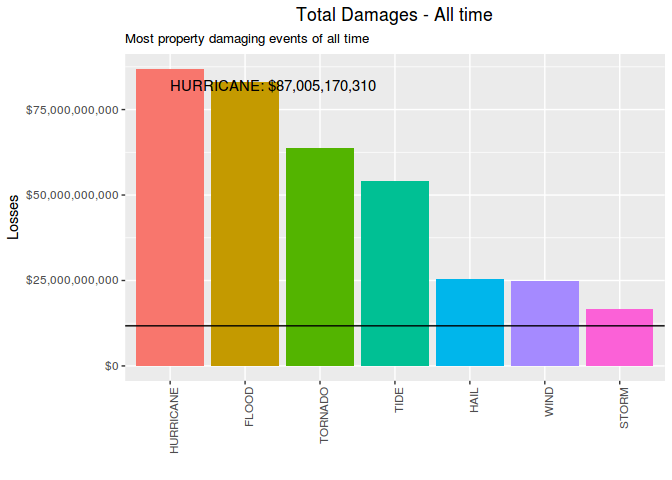

The most property damaging event along the time is the **HURRICANE. It
has caused $4,451,850,000 in losses.**

Just for curiosity, these are the less damaging events:

    prop.all.df <- prop.df %>% group_by(event) %>%
                    summarise(total.raw = sum(prop.ev)) %>%
                    arrange(total.raw) %>%
                    mutate(media.raw = mean(total.raw), 
                            mediana.raw = median(total.raw),
                            total = dollar(total.raw),
                            mean = dollar(media.raw),
                            median = dollar(mediana.raw),
                            rank = seq(length(event),1, by=-1))

    kable(prop.all.df[1:10, c(8,1,5:7)])

<table>
<thead>
<tr class="header">
<th align="right">rank</th>
<th align="left">event</th>
<th align="left">total</th>
<th align="left">mean</th>
<th align="left">median</th>
</tr>
</thead>
<tbody>
<tr class="odd">
<td align="right">25</td>
<td align="left">DUST DEVIL</td>
<td align="left">$20,500</td>
<td align="left">$576,229,411</td>
<td align="left">$5,740,000</td>
</tr>
<tr class="even">
<td align="right">24</td>
<td align="left">DRY MICROBURST</td>
<td align="left">$147,500</td>
<td align="left">$576,229,411</td>
<td align="left">$5,740,000</td>
</tr>
<tr class="odd">
<td align="right">23</td>
<td align="left">AVALANCHE</td>
<td align="left">$225,500</td>
<td align="left">$576,229,411</td>
<td align="left">$5,740,000</td>
</tr>
<tr class="even">
<td align="right">22</td>
<td align="left">WINTER WEATHER/MIX</td>
<td align="left">$252,000</td>
<td align="left">$576,229,411</td>
<td align="left">$5,740,000</td>
</tr>
<tr class="odd">
<td align="right">21</td>
<td align="left">WATERSPOUT</td>
<td align="left">$575,500</td>
<td align="left">$576,229,411</td>
<td align="left">$5,740,000</td>
</tr>
<tr class="even">
<td align="right">20</td>
<td align="left">FOG</td>
<td align="left">$810,000</td>
<td align="left">$576,229,411</td>
<td align="left">$5,740,000</td>
</tr>
<tr class="odd">
<td align="right">19</td>
<td align="left">DENSE FOG</td>
<td align="left">$815,000</td>
<td align="left">$576,229,411</td>
<td align="left">$5,740,000</td>
</tr>
<tr class="even">
<td align="right">18</td>
<td align="left">URBAN/SML STREAM FLD</td>
<td align="left">$1,341,000</td>
<td align="left">$576,229,411</td>
<td align="left">$5,740,000</td>
</tr>
<tr class="odd">
<td align="right">17</td>
<td align="left">WINTER WEATHER</td>
<td align="left">$1,567,000</td>
<td align="left">$576,229,411</td>
<td align="left">$5,740,000</td>
</tr>
<tr class="even">
<td align="right">16</td>
<td align="left">LANDSLIDE</td>
<td align="left">$2,065,500</td>
<td align="left">$576,229,411</td>
<td align="left">$5,740,000</td>
</tr>
</tbody>
</table>

### Crop losses

### Most Crop Damaging event in a single occurrence

Most Crop Damaging event in a single occurrence

In order to determine what were the most crop damaging events in a
single occurrence, we need to see how damages are distributed along the
occurrences.

    # crop damages
    rm(prop.df, prop.all.df, prop95.df) # cleannig house

    crop.df <- harm.df %>% filter(!is.na(crop.ev)) %>%
                    select(1:6,14) 

    # quantiles
    qt <- quantile(crop.df$crop.ev, probs=seq(.975,1,0.002))

    # distribution plot
    plt.distr.crop0 <- ggplot(crop.df, aes(log(crop.ev)))

    plt.distr.crop0 <- plt.distr.crop0 + geom_density(aes(y=..density..)) + #xlim(0,.5) + 
            labs(title="All events", x="log(amount $)") +
            theme(plot.title = element_text(hjust = 0.5))  

    # display only the qts next to harmfull events
    qt

    ##    97.5%    97.7%    97.9%    98.1%    98.3%    98.5%    98.7%    98.9% 
    ##    50000    53690   100000   100000   100000   200000   200000   250000 
    ##    99.1%    99.3%    99.5%    99.7%    99.9% 
    ##   500000   500000  1000000  3000000 20000000

Looking at this distribution, we can infer that 95% of the occurrences
caused less than **$50,000 in losses**.

On the other hand, damaging occurrences had to have damages above zero.

Now, among the damaging occurrences, we are interested in the ones whose
damages are beyond the confidence interval, ie. above 95% of the most
common values.

    # subset for harm events
    crop.df <- crop.df %>% filter(crop.ev > 0) %>%
                    arrange(desc(crop.ev)) %>%
                    mutate(value = dollar(crop.ev),
                            media.raw = mean(crop.ev), 
                            mediana.raw = median(crop.ev),
                            mean = dollar(media.raw),
                            median = dollar(mediana.raw),
                            rank = seq_len(length(event)))

    # quantiles, same as 
    # poisson.test(mean, conf.level = 0.95)

    qt <- quantile(crop.df$crop.ev, probs=seq(.975,1,0.005))
    qt

    ##     97.5%       98%     98.5%       99%     99.5%      100% 
    ##   5000000  10120000  16120000  20040000  50100000 500000000

Distribution plots

    # distribution plot
    plt.distr.crop1 <- ggplot(crop.df, aes(log(crop.ev)))

    plt.distr.crop1 <- plt.distr.crop1 + geom_density(aes(y=..density..)) + #xlim(0,qt[1]) + 
            labs(title="Damaging events", x="log(amount $)") +
            # scale_x_continuous(labels = dollar)+
            # theme(axis.text.x = element_text(angle = 90, hjust = 1)) + 
            theme(plot.title = element_text(hjust = 0.5))       

    grid.arrange(plt.distr.crop0, plt.distr.crop1, nrow=1, ncol=2, 
                 bottom="Figure - Distribution of Losses: all events VS damaging events")
    grid.rect(gp=gpar(fill=NA))  

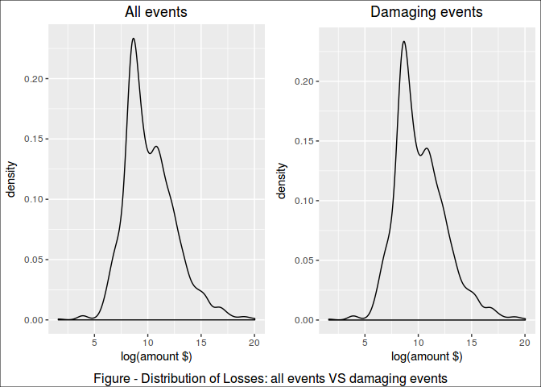

Looking at this distribution, we can infer that **95% of the damaging
occurrences caused up to $5,000,000 in losses.**

In this study, we looked on the 5% most harmful occurrences.

    # subset for 95% CI
    crop95.df <- filter(crop.df, crop.ev>qt[1])

    # create color pallete for all events
    colourCount = length(unique(crop95.df$event))
    getPalette = colorRampPalette(brewer.pal(colourCount, "Set1"))

    # print a table
    kable(crop95.df[,c(13,1:6,8,11:12)])

<table>
<thead>
<tr class="header">
<th align="right">rank</th>
<th align="left">event</th>
<th align="right">mag</th>
<th align="left">day</th>
<th align="right">duration</th>
<th align="left">state</th>
<th align="left">countyname</th>
<th align="left">value</th>
<th align="left">mean</th>
<th align="left">median</th>
</tr>
</thead>
<tbody>
<tr class="odd">
<td align="right">1</td>
<td align="left">DROUGHT</td>
<td align="right">0</td>
<td align="left">1998-07-06</td>
<td align="right">0S</td>
<td align="left">OK</td>
<td align="left">OKZ049 -</td>
<td align="left">$500,000,000</td>
<td align="left">$1,660,614</td>
<td align="left">$20,000</td>
</tr>
<tr class="even">
<td align="right">2</td>
<td align="left">FLOOD</td>
<td align="right">0</td>
<td align="left">2008-06-01</td>
<td align="right">0S</td>
<td align="left">IA</td>
<td align="left">MARSHALL</td>
<td align="left">$250,000,000</td>
<td align="left">$1,660,614</td>
<td align="left">$20,000</td>
</tr>
<tr class="odd">
<td align="right">3</td>
<td align="left">WIND</td>
<td align="right">94</td>
<td align="left">2004-08-13</td>
<td align="right">0S</td>
<td align="left">FL</td>
<td align="left">FLZ052 -</td>
<td align="left">$175,000,000</td>
<td align="left">$1,660,614</td>
<td align="left">$20,000</td>
</tr>
<tr class="even">
<td align="right">4</td>
<td align="left">DROUGHT</td>
<td align="right">0</td>
<td align="left">2000-12-01</td>
<td align="right">0S</td>
<td align="left">LA</td>
<td align="left">LAZ027&gt;03</td>
<td align="left">$169,600,000</td>
<td align="left">$1,660,614</td>
<td align="left">$20,000</td>
</tr>
<tr class="odd">
<td align="right">5</td>
<td align="left">DROUGHT</td>
<td align="right">0</td>
<td align="left">2006-06-01</td>
<td align="right">0S</td>
<td align="left">OK</td>
<td align="left">OKZ004&gt;04</td>
<td align="left">$151,000,000</td>
<td align="left">$1,660,614</td>
<td align="left">$20,000</td>
</tr>
<tr class="even">
<td align="right">6</td>
<td align="left">DROUGHT</td>
<td align="right">0</td>
<td align="left">2005-08-01</td>
<td align="right">0S</td>
<td align="left">TX</td>
<td align="left">TXZ092&gt;09</td>
<td align="left">$60,000,000</td>
<td align="left">$1,660,614</td>
<td align="left">$20,000</td>
</tr>
<tr class="odd">
<td align="right">7</td>
<td align="left">COLD|FREEZ</td>
<td align="right">0</td>
<td align="left">2005-04-13</td>
<td align="right">0S</td>
<td align="left">WA</td>
<td align="left">WAZ027</td>
<td align="left">$50,000,000</td>
<td align="left">$1,660,614</td>
<td align="left">$20,000</td>
</tr>
<tr class="even">
<td align="right">8</td>
<td align="left">DROUGHT</td>
<td align="right">0</td>
<td align="left">1999-08-01</td>
<td align="right">0S</td>
<td align="left">VA</td>
<td align="left">VAZ021 -</td>
<td align="left">$41,660,000</td>
<td align="left">$1,660,614</td>
<td align="left">$20,000</td>
</tr>
<tr class="odd">
<td align="right">9</td>
<td align="left">WIND</td>
<td align="right">61</td>
<td align="left">2011-09-02</td>
<td align="right">0S</td>
<td align="left">IA</td>
<td align="left">MITCHELL</td>
<td align="left">$41,000,000</td>
<td align="left">$1,660,614</td>
<td align="left">$20,000</td>
</tr>
<tr class="even">
<td align="right">10</td>
<td align="left">DROUGHT</td>
<td align="right">0</td>
<td align="left">2006-08-01</td>
<td align="right">0S</td>
<td align="left">TX</td>
<td align="left">TXZ023&gt;02</td>
<td align="left">$26,000,000</td>
<td align="left">$1,660,614</td>
<td align="left">$20,000</td>
</tr>
<tr class="odd">
<td align="right">11</td>
<td align="left">HURRICANE</td>
<td align="right">0</td>
<td align="left">2004-09-13</td>
<td align="right">0S</td>
<td align="left">FL</td>
<td align="left">FLZ001&gt;00</td>
<td align="left">$25,000,000</td>
<td align="left">$1,660,614</td>
<td align="left">$20,000</td>
</tr>
<tr class="even">
<td align="right">12</td>
<td align="left">HAIL</td>
<td align="right">175</td>
<td align="left">1996-07-16</td>
<td align="right">0S</td>
<td align="left">NE</td>
<td align="left">DAKOTA</td>
<td align="left">$22,000,000</td>
<td align="left">$1,660,614</td>
<td align="left">$20,000</td>
</tr>
<tr class="odd">
<td align="right">13</td>
<td align="left">FLOOD</td>
<td align="right">0</td>
<td align="left">2010-06-12</td>
<td align="right">0S</td>
<td align="left">IA</td>
<td align="left">RINGGOLD</td>
<td align="left">$20,000,000</td>
<td align="left">$1,660,614</td>
<td align="left">$20,000</td>
</tr>
<tr class="even">
<td align="right">14</td>
<td align="left">WIND</td>
<td align="right">0</td>
<td align="left">1998-05-31</td>
<td align="right">0S</td>
<td align="left">MI</td>
<td align="left">KENT</td>
<td align="left">$20,000,000</td>
<td align="left">$1,660,614</td>
<td align="left">$20,000</td>
</tr>
<tr class="odd">
<td align="right">15</td>
<td align="left">FLOOD</td>
<td align="right">0</td>
<td align="left">2010-06-12</td>
<td align="right">0S</td>
<td align="left">IA</td>
<td align="left">MARSHALL</td>
<td align="left">$20,000,000</td>
<td align="left">$1,660,614</td>
<td align="left">$20,000</td>
</tr>
<tr class="even">
<td align="right">16</td>
<td align="left">WIND</td>
<td align="right">55</td>
<td align="left">2007-07-15</td>
<td align="right">0S</td>
<td align="left">ND</td>
<td align="left">CASS</td>
<td align="left">$20,000,000</td>
<td align="left">$1,660,614</td>
<td align="left">$20,000</td>
</tr>
<tr class="odd">
<td align="right">17</td>
<td align="left">FLOOD</td>
<td align="right">0</td>
<td align="left">2010-06-12</td>
<td align="right">0S</td>
<td align="left">IA</td>
<td align="left">HAMILTON</td>
<td align="left">$20,000,000</td>
<td align="left">$1,660,614</td>
<td align="left">$20,000</td>
</tr>
<tr class="even">
<td align="right">18</td>
<td align="left">FLOOD</td>
<td align="right">0</td>
<td align="left">2010-06-12</td>
<td align="right">0S</td>
<td align="left">IA</td>
<td align="left">BOONE</td>
<td align="left">$20,000,000</td>
<td align="left">$1,660,614</td>
<td align="left">$20,000</td>
</tr>
<tr class="odd">
<td align="right">19</td>
<td align="left">WIND</td>
<td align="right">64</td>
<td align="left">1996-07-12</td>
<td align="right">0S</td>
<td align="left">NC</td>
<td align="left">NCZ099</td>
<td align="left">$16,000,000</td>
<td align="left">$1,660,614</td>
<td align="left">$20,000</td>
</tr>
<tr class="even">
<td align="right">20</td>
<td align="left">WIND</td>
<td align="right">80</td>
<td align="left">1995-07-13</td>
<td align="right">NA</td>
<td align="left">MN</td>
<td align="left">MNZ003 -</td>
<td align="left">$16,000,000</td>
<td align="left">$1,660,614</td>
<td align="left">$20,000</td>
</tr>
<tr class="odd">
<td align="right">21</td>
<td align="left">HAIL</td>
<td align="right">2</td>
<td align="left">2010-10-21</td>
<td align="right">1d 0H 0M 0S</td>
<td align="left">TX</td>
<td align="left">TERRY</td>
<td align="left">$15,000,000</td>
<td align="left">$1,660,614</td>
<td align="left">$20,000</td>
</tr>
<tr class="even">
<td align="right">22</td>
<td align="left">HURRICANE</td>
<td align="right">0</td>
<td align="left">1999-11-16</td>
<td align="right">0S</td>
<td align="left">PR</td>
<td align="left">PRZ005 -</td>
<td align="left">$14,000,000</td>
<td align="left">$1,660,614</td>
<td align="left">$20,000</td>
</tr>
<tr class="odd">
<td align="right">23</td>
<td align="left">RAIN|PRECIP</td>
<td align="right">0</td>
<td align="left">2003-04-01</td>
<td align="right">0S</td>
<td align="left">CA</td>
<td align="left">MADERA</td>
<td align="left">$13,200,000</td>
<td align="left">$1,660,614</td>
<td align="left">$20,000</td>
</tr>
<tr class="even">
<td align="right">24</td>
<td align="left">TORNADO</td>
<td align="right">0</td>
<td align="left">2009-05-08</td>
<td align="right">0S</td>
<td align="left">MO</td>
<td align="left">SHANNON</td>
<td align="left">$13,000,000</td>
<td align="left">$1,660,614</td>
<td align="left">$20,000</td>
</tr>
<tr class="odd">
<td align="right">25</td>
<td align="left">FLOOD</td>
<td align="right">0</td>
<td align="left">2008-07-29</td>
<td align="right">0S</td>
<td align="left">MO</td>
<td align="left">RALLS</td>
<td align="left">$10,000,000</td>
<td align="left">$1,660,614</td>
<td align="left">$20,000</td>
</tr>
<tr class="even">
<td align="right">26</td>
<td align="left">HAIL</td>
<td align="right">175</td>
<td align="left">1997-06-25</td>
<td align="right">0S</td>
<td align="left">NE</td>
<td align="left">KIMBALL</td>
<td align="left">$6,000,000</td>
<td align="left">$1,660,614</td>
<td align="left">$20,000</td>
</tr>
<tr class="odd">
<td align="right">27</td>
<td align="left">URBAN/SML STREAM FLD</td>
<td align="right">0</td>
<td align="left">1998-03-31</td>
<td align="right">1d 0H 0M 0S</td>
<td align="left">CA</td>
<td align="left">KERN</td>
<td align="left">$5,700,000</td>
<td align="left">$1,660,614</td>
<td align="left">$20,000</td>
</tr>
</tbody>
</table>

    worst.crop.single.ev <- crop95.df$event[1]
    worst.crop.single.st <- crop95.df$state[1]
    worst.crop.single.ct <- crop95.df$countyname[1]
    worst.crop.single.dt <- crop95.df$day[1]
    worst.crop.single.value <- crop95.df$value[1]

    plt.crop.single <- ggplot(crop95.df, aes(day, crop.ev, colour=event))

    (plt.crop.single <- plt.crop.single + geom_point() +
            geom_text(aes(label=ifelse(rank <= 10,
                    as.character(day),""),
                    hjust=-.03,vjust=0.5)) +
            geom_hline(aes(yintercept = media.raw), linetype=2) +
            geom_hline(aes(yintercept = mediana.raw), linetype=3) +
            labs(title="Most Crop Dammaging Events in a Single Occurrence",
                        y="Damages", x="") + 
                    
            expand_limits(x=as.Date('2017-01-01'))+ #ok
            scale_y_continuous(labels = dollar)+
            
            scale_colour_manual(values = getPalette(colourCount))+                
            theme(legend.title=element_blank()) +
            theme(legend.position="bottom") +
            guides(fill=guide_legend(nrow=5, byrow=TRUE)) +
            theme(axis.text.x = element_text(angle = 90, hjust = 1)) + 
            theme(plot.title = element_text(hjust = 0.5)) 
    )  

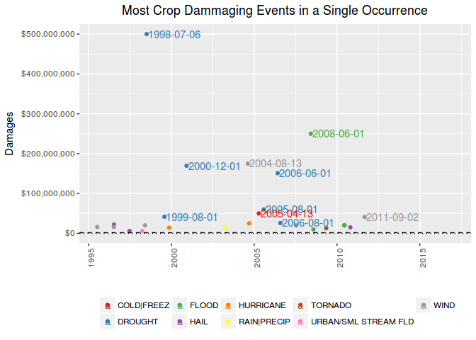

The single most economic damaging event to crops was a **DROUGHT, that
occurred in OK, OKZ049 - , on 1998-07-06, causing U$ $500,000,000 in
losses.**

### Most Crop Damaging event in all time

Most Crop Damaging event in all time

Notice that are several occurrences of the same type of event along the
time.

Therefore, in order to know which is the worst type of event along all
the years, we summed up the losses caused by each one of occurrences of
this events.

Notice that we are interested only in the worst of them, ie, the ones
which are above the mean.

    # totals per event
    crop.all.df <- crop.df %>% group_by(event) %>%
                    summarise(total.raw = sum(crop.ev)) %>%
                    arrange(desc(total.raw)) %>%
                    mutate(media.raw = mean(total.raw), 
                            mediana.raw = median(total.raw),
                            total = dollar(total.raw),
                            mean = dollar(media.raw),
                            median = dollar(mediana.raw),
                            rank = seq_len(length(event))) %>%
                    filter(total.raw > mean(total.raw))
                    
    # create color pallete for all events
    colourCount = length(unique(crop.all.df$event))
    getPalette = colorRampPalette(brewer.pal(colourCount, "Set1"))

    # prepare text for inline R
    worst.crop.all.ev <- crop.all.df$event[1]
    worst.crop.total <- crop.all.df$total[1]

    # a table
    kable(crop.all.df[, c(8,1,5:7)])

<table>
<thead>
<tr class="header">
<th align="right">rank</th>
<th align="left">event</th>
<th align="left">total</th>
<th align="left">mean</th>
<th align="left">median</th>
</tr>
</thead>
<tbody>
<tr class="odd">
<td align="right">1</td>
<td align="left">DROUGHT</td>
<td align="left">$951,577,000</td>
<td align="left">$124,442,257</td>
<td align="left">$12,121,000</td>
</tr>
<tr class="even">
<td align="right">2</td>
<td align="left">FLOOD</td>
<td align="left">$396,753,000</td>
<td align="left">$124,442,257</td>
<td align="left">$12,121,000</td>
</tr>
<tr class="odd">
<td align="right">3</td>
<td align="left">WIND</td>
<td align="left">$330,213,855</td>
<td align="left">$124,442,257</td>
<td align="left">$12,121,000</td>
</tr>
<tr class="even">
<td align="right">4</td>
<td align="left">HAIL</td>
<td align="left">$150,330,000</td>
<td align="left">$124,442,257</td>
<td align="left">$12,121,000</td>
</tr>
</tbody>
</table>

    plt.crop.all <- ggplot(data=crop.all.df, aes(event, total.raw, fill=event))

    (plt.crop.all <- plt.crop.all + geom_bar(stat="identity") +
                    
            geom_text(aes(label=ifelse(total.raw==max(total.raw),
                    paste(event, dollar(max(total.raw)), sep=": "),'')),
                    hjust=0,vjust=2) +
            geom_hline(aes(yintercept = media.raw), linetype=1) +
            geom_hline(aes(yintercept = mediana.raw), linetype=2) +
            labs(title="Most Crop damaging event", y="Damages", x="") + 
                    
            scale_y_continuous(labels = dollar)+
         
            theme(legend.position="none") +        
            scale_colour_manual(values = getPalette(colourCount))+                
            theme(legend.title=element_blank()) +
            theme(axis.text.x = element_text(angle = 90, hjust = 1)) + 
            theme(plot.title = element_text(hjust = 0.5))                 
      
    )  

The most crop damaging event along the time is the **DROUGHT. It has
caused $951,577,000 in losses.**

Just for curiosity, lets show now what are the less damaging among the
events:

    crop.all.df <- crop.df %>% group_by(event) %>%
                    summarise(total.raw = sum(crop.ev)) %>%
                    arrange(total.raw) %>%
                    mutate(media.raw = mean(total.raw), 
                            mediana.raw = median(total.raw),
                            total = dollar(total.raw),
                            mean = dollar(media.raw),
                            median = dollar(mediana.raw),
                            rank = seq(length(event),1, by=-1))

    kable(crop.all.df[1:10, c(8,1,5:7)])

<table>
<thead>
<tr class="header">
<th align="right">rank</th>
<th align="left">event</th>
<th align="left">total</th>
<th align="left">mean</th>
<th align="left">median</th>
</tr>
</thead>
<tbody>
<tr class="odd">
<td align="right">16</td>
<td align="left">SNOW</td>
<td align="left">$200</td>
<td align="left">$124,442,257</td>
<td align="left">$12,121,000</td>
</tr>
<tr class="even">
<td align="right">15</td>
<td align="left">DRY MICROBURST</td>
<td align="left">$5,000</td>
<td align="left">$124,442,257</td>
<td align="left">$12,121,000</td>
</tr>
<tr class="odd">
<td align="right">14</td>
<td align="left">LIGHTNING</td>
<td align="left">$32,600</td>
<td align="left">$124,442,257</td>
<td align="left">$12,121,000</td>
</tr>
<tr class="even">
<td align="right">13</td>
<td align="left">TIDE</td>
<td align="left">$100,000</td>
<td align="left">$124,442,257</td>
<td align="left">$12,121,000</td>
</tr>
<tr class="odd">
<td align="right">12</td>
<td align="left">FIRE</td>
<td align="left">$513,000</td>
<td align="left">$124,442,257</td>
<td align="left">$12,121,000</td>
</tr>
<tr class="even">
<td align="right">11</td>
<td align="left">STORM</td>
<td align="left">$630,000</td>
<td align="left">$124,442,257</td>
<td align="left">$12,121,000</td>
</tr>
<tr class="odd">
<td align="right">10</td>
<td align="left">OTHER</td>
<td align="left">$768,960</td>
<td align="left">$124,442,257</td>
<td align="left">$12,121,000</td>
</tr>
<tr class="even">
<td align="right">9</td>
<td align="left">URBAN/SML STREAM FLD</td>
<td align="left">$5,730,000</td>
<td align="left">$124,442,257</td>
<td align="left">$12,121,000</td>
</tr>
<tr class="odd">
<td align="right">8</td>
<td align="left">RAIN|PRECIP</td>
<td align="left">$18,512,000</td>
<td align="left">$124,442,257</td>
<td align="left">$12,121,000</td>
</tr>
<tr class="even">
<td align="right">7</td>
<td align="left">TORNADO</td>
<td align="left">$28,101,500</td>
<td align="left">$124,442,257</td>
<td align="left">$12,121,000</td>
</tr>
</tbody>
</table>

Most aflicted locations - under construction
--------------------------------------------

Most afflicted locations

We have determined what locations had the worst impact from those
events, both in terms of human health and economic losses.

under construction

Results
-------

### Population Health

The single most fatal event was a **HEAT|WARM, that occurred in AZ,
AZZ023, on 2005-07-12, killing 30 people.**

The most fatal event along the time is the **TORNADO. It has killed 219
people until now.**

The single most injuring event was a **TORNADO, that occurred in IL,
WILL, on 1990-08-28, injuring 350 people.**

The most injuring event along the time is the **TORNADO. It has injuried
4146 people until now.**

### Economic Damages

The single most economic damaging event to properties was a **HURRICANE,
that occurred in FL, FLZ001&gt;00, on 2004-09-13, causing U$
$4,000,000,000 in losses**.

The most property damaging event along the time is the **HURRICANE. It
has caused $4,451,850,000 in losses.**

The single most economic damaging event to crops was a **DROUGHT, that
occurred in OK, OKZ049 - , on 1998-07-06, causing U$ $500,000,000 in
losses**.

The most crop damaging event along the time is the **DROUGHT. It has
caused $951,577,000 in losses.**
